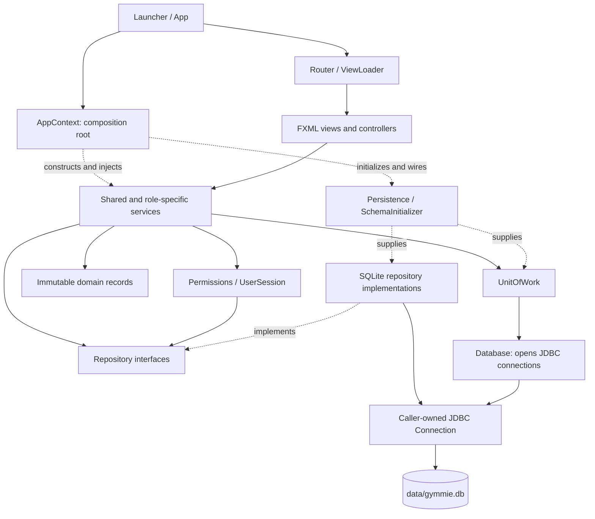
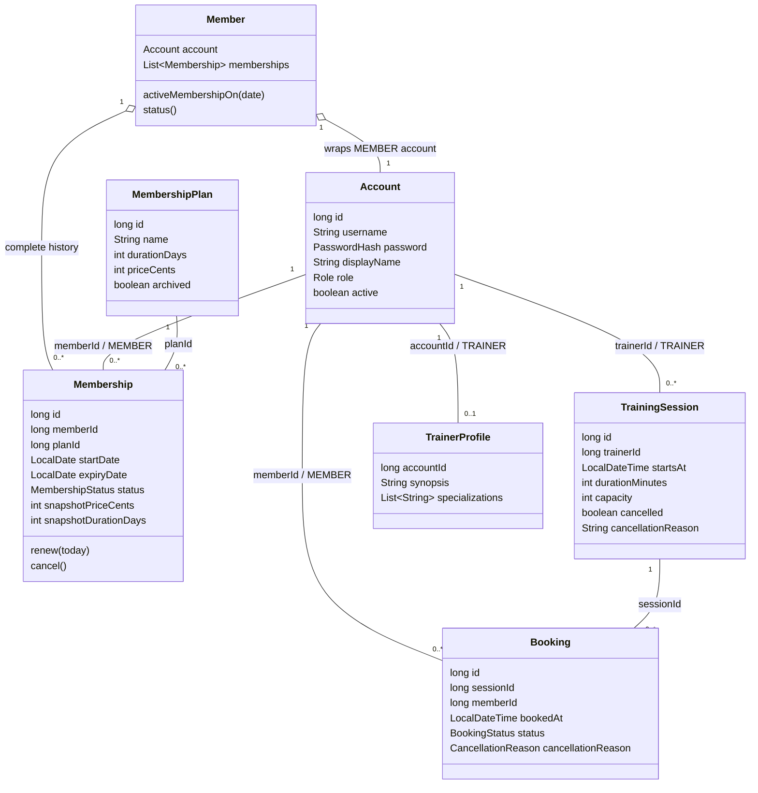
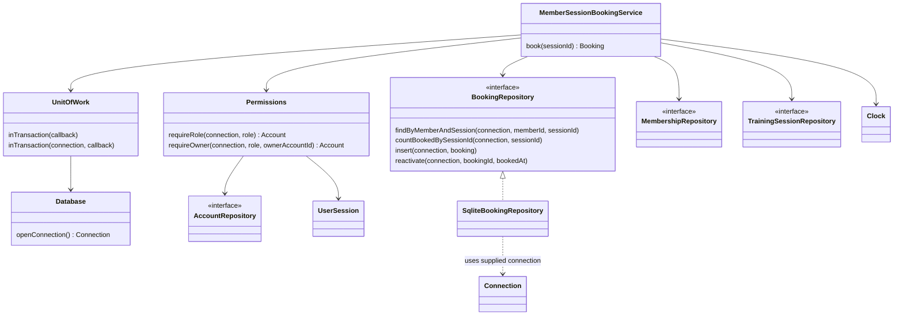
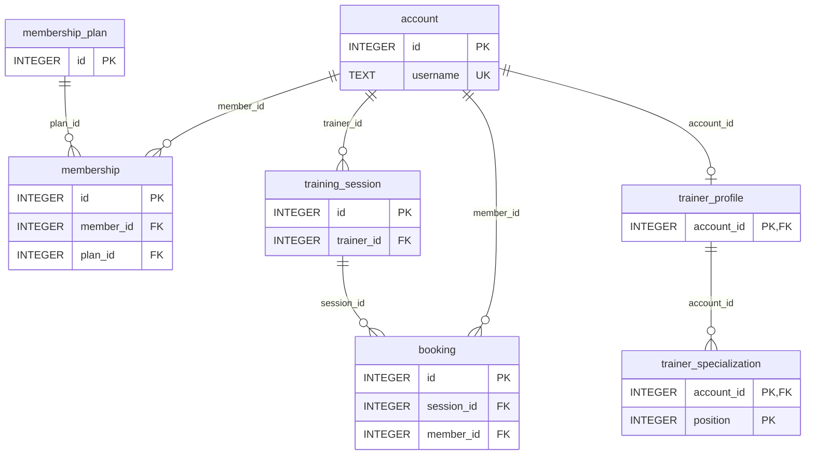

# Gymmie Developer Guide

Gymmie is a Java 25 JavaFX desktop application for managing a gym's membership plans, user accounts, training sessions, and session bookings. It supports three roles: Manager, Trainer, and Member.

The repository contains JavaFX login and role-specific dashboards, an immutable domain model, and SQLite persistence. Implemented workflows include Manager plan and account administration, Trainer profiles and session management, and Member membership purchases, renewals, cancellations, and session bookings.

`AppContext` is the composition root: it constructs `Database`, calls `SchemaInitializer.initialize()`, and then constructs persistence and shared services and seeds the Manager. `App.init()` creates this context before `App.start()` creates the router. `Router` owns one scene and selects the dashboard from the authenticated role; `ViewLoader` loads bundled FXML with explicitly injected controllers. Controllers run authentication and password changes on background tasks and update JavaFX controls on the application thread. Service-level authorization remains authoritative.

For end-user instructions, see the [User Guide](UserGuide.md). The requirements appendix includes both implemented workflows and future scope; it is not an implementation checklist.

## Contents

- [Acknowledgements](#acknowledgements)
- [Setting up, getting started](#setting-up-getting-started)
- [Architectural design](#architectural-design)
- [Shared UI conventions](#shared-ui-conventions)
- [Domain model](#domain-model)
- [Class diagrams](#class-diagrams)
- [Repository contracts](#repository-contracts)
- [Database schema](#database-schema)
- [Authentication and authorization](#authentication-and-authorization)
- [Sequence diagram: booking a session](#sequence-diagram-booking-a-session)
- [Sequence diagram: cancelling a membership](#sequence-diagram-cancelling-a-membership)
- [How to test](#how-to-test)
- [Appendix: Requirements](#appendix-requirements)

---

## Acknowledgements

- [OpenJFX](https://openjfx.io/) provides the JavaFX 25 GUI modules used by the application.
- [JUnit 5](https://junit.org/junit5/) provides the test framework.
- [Gradle](https://gradle.org/) and the [Gradle Wrapper](https://docs.gradle.org/current/userguide/gradle_wrapper.html) provide the build and dependency-management workflow. The project also uses the [Shadow](https://gradleup.com/shadow/) plugin to create a runnable fat JAR.
- [Checkstyle](https://checkstyle.org/) and [JaCoCo](https://www.jacoco.org/jacoco/) are used for source checks and code-coverage reporting.
- The overall structure of this guide, including its requirements appendix and use-case format, follows the supplied sample Developer Guide, which in turn acknowledges the [AddressBook-Level3](https://github.com/se-edu/addressbook-level3) Developer Guide by the [SE-EDU initiative](https://se-education.org/). No AddressBook source code is reused.
- Gymmie was built with AI assistance. The project-specific conventions and constraints given to the assistant are recorded in [`AGENTS.md`](../AGENTS.md).

## Setting up, getting started

**Prerequisites:** JDK 25, Git, and a desktop environment capable of running JavaFX.

Verify that both `java -version` and `javac -version` report version 25. Clone the repository, then run commands from the repository root, which is the folder containing `build.gradle`. On Windows PowerShell, replace `./gradlew` with `.\gradlew.bat`.

| Command | Purpose |
| --- | --- |
| `./gradlew run` | Launch the JavaFX application during development. |
| `./gradlew test` | Run JUnit tests; opt-in JavaFX tests are skipped. |
| `./gradlew check` | Run default tests and Checkstyle. |
| `./gradlew test -PuiTests=true` | Include JavaFX integration tests; requires a graphical desktop. |
| `./gradlew shadowJar` | Create a runnable fat JAR in `build/libs/`. |
| `java -jar build/libs/Gymmie-1.0.0-all.jar` | Launch the packaged application when that file has been built. |

**Build configuration:** Java 25 toolchain, JavaFX 25.0.2 (`javafx.controls` and `javafx.fxml`), Gradle Wrapper 9.7.1, JUnit Jupiter 5.14.4, Checkstyle 14.1.0, JaCoCo 0.8.15, and the application entry point `gymmie.Launcher`.

Test, Checkstyle, and JaCoCo reports are written under `build/reports/` by Gradle. Build output is generated under `build/`.

---

## Architectural design

Gymmie is a layered desktop application running in one JVM, with a local SQLite
database and no remote application server. Role-specific packages organize
features while shared models, security, and persistence provide common boundaries.
The diagrams in this guide use Mermaid and render in GitHub's Markdown preview.



Solid arrows show usage or data access; dotted arrows show wiring or interface
implementation. Repository calls receive the connection created for the service's
transaction; repositories do not open their own connections.

| Layer | Main locations | Responsibility |
| --- | --- | --- |
| Startup and navigation | `gymmie.App`, `AppContext`, `Router`, `ViewLoader` | Initialize storage, construct dependencies, load FXML with injected controllers, and select role screens. |
| Presentation | Controllers in `gymmie`, `gymmie.manager`, `gymmie.trainer`, `gymmie.member`; FXML/CSS under `src/main/resources/gymmie` | Read input, invoke services, and show progress, results, and errors. Shared presentation helpers live in `gymmie.ui`. |
| Application services | `gymmie.service` and each role's `service` package | Enforce authorization, ownership, workflow rules, and transaction boundaries. |
| Domain | `gymmie.model`, `gymmie.trainer.model` | Validate immutable records and represent lifecycle transitions without JavaFX or database dependencies. |
| Persistence | `gymmie.persistence`, its `repository` and `sqlite` packages, and `gymmie.trainer.persistence` | Store records using JDBC and preserve history and atomic updates. |

### Startup and request handling

1. `Launcher` launches `App`; `App.init()` creates `AppContext`.
2. The context initializes the schema, constructs `Persistence`, seeds
   the Manager, and wires shared and role-specific services.
3. `App.start()` constructs the router and opens login. Authentication populates
   `UserSession`; navigation selects the authenticated role's dashboard.
4. Controllers use background JavaFX `Task`s for service work such as login and
   booking. Completion handlers update controls on the JavaFX application thread.
5. A protected service starts a `UnitOfWork` transaction, checks the current
   account, and passes the same connection to all repository operations. The
   transaction commits before the result is returned, or rolls back on failure.

### Design decisions

- **Explicit dependency injection:** `AppContext` assembles services and
  `ViewLoader` supplies controllers, keeping construction separate from workflows
  and allowing tests to use isolated databases and fixed clocks.
- **Service-level RBAC:** hiding a button is only presentation behavior.
  `Permissions` reloads the account on the transaction connection and enforces an
  exact role and, where needed, ownership. Manager does not inherit other roles.
- **Immutable domain state:** records validate local invariants; services load
  related records to enforce cross-record rules such as capacity and membership
  eligibility. Memberships retain purchase-time price and duration snapshots.
- **Atomic workflows:** cancellation of a membership or session and the affected
  bookings shares one transaction. Nested work reuses the supplied connection;
  the connection-taking `UnitOfWork` overload uses a savepoint when already in a
  transaction.
- **History preservation:** accounts are deactivated, purchased plans archived,
  and booked sessions cancelled. Guarded deletion exists only for unused plans
  and sessions that have never had a booking.
- **Local deployment:** dates and times use the system's local zone. Run only one
  Gymmie process against a data folder; there is no cross-instance coordination.

## Shared UI conventions

Every role uses `gymmie/css/gymmie.css`, declared on each FXML root. Shared views
under `gymmie/view/` use `stylesheets="@../css/gymmie.css"`; role-specific views
under `gymmie/<role>/view/` use `stylesheets="@../../css/gymmie.css"`. Some role
views also declare a local stylesheet for feature-specific layout. These FXML
declarations make stylesheets visible to IntelliJ and Scene Builder as well as
the application. Router does not also attach the shared stylesheet to
the scene. Programmatic scenes and alerts use the same stylesheet through
`SharedStyles` and `UiFeedback`. Extend this stylesheet rather than adding
role-specific themes. Shared classes include `page`, `card`, `brand`, `title`,
`heading`, and `status`; palette values are JavaFX looked-up colors.

Use `StatusLabel` for inline progress, validation, service failures, and success.
Its `info`, `error`, and `success` methods reset the visual state and include text
cues for errors and success. Use `UiFeedback.errorAlert`, `informationAlert`, and
`confirm` for owned dialogs. Create and show controls on the JavaFX thread;
confirmation returns false for Cancel, Escape, or closing the window.
`UiFeedback.errorMessage` preserves domain/service messages, including wrapped
asynchronous failures, and gives deactivated accounts distinct guidance.
Unexpected persistence and I/O errors use a caller-provided safe fallback.

Use `DisplayFormatters` for all displayed prices, dates, and times:

| Value | Display | Convention |
| --- | --- | --- |
| 4990 cents | `SGD 49.90` | Exactly two decimal places, computed from integer cents. |
| Local date | `25 Sep 2026` | `dd MMM uuuu`, English month abbreviations. |
| Local time | `15:04` | `HH:mm`, 24-hour clock, without seconds. |
| Local timestamp | `25 Sep 2026, 15:04` | Combined date and time. |

Dates and times retain their stored local values, consistent with the local
system-time requirement. Display output is independent of the OS locale. These
helpers format required values; callers decide how to label missing values.
Storage continues to use ISO text and integer cents.

In IntelliJ, use **Settings → Languages & Frameworks → Style Sheets → Dialects**
to assign the **JavaFX** dialect to `src/main/resources/gymmie/css` if browser-CSS
inspections flag `-fx-*` properties or JavaFX pseudo-classes. JavaFX support must
be enabled in the IDE. Keep JavaFX properties and looked-up palette colors;
replacing them with browser CSS would break the application theme.

## Domain model

The `gymmie.model` package uses Java records and composition. `Account` represents all three roles; `Member` combines a Member-role account with its complete membership history. The model has no JavaFX or database dependencies.

- Record constructors enforce field constraints, non-null required fields, and positive identifiers. Callers allocate identifiers before construction. Username matching uses an ASCII-only, locale-independent key while preserving the original spelling. Display-name and password lengths count Unicode code points, without trimming or normalizing the supplied values.
- `PasswordHash.fromPassword` validates the 8–128-character password and creates a PBKDF2-HMAC-SHA256 hash with 600,000 iterations, a random 16-byte salt, and a 32-byte output. `Account` holds this value rather than plaintext. Persist `hash()` and `salt()` in the existing account columns; their Base64 contents are validated on rehydration and redacted from `toString()`. The current format has fixed algorithm parameters; changing them requires a compatibility strategy for existing credentials.
- `MembershipPlan` holds integer cents and duration days. `Membership.purchase` copies those values into the membership snapshot; subsequent catalogue changes do not affect it. New purchases reject archived plans. The expiry date is the purchase date plus the purchased duration. `Membership.renew` preserves the plan and snapshots, and adds the saved duration to the later of today and the existing expiry date. Coverage includes the expiry date.
- `Membership.isActiveOn` derives eligibility from lifecycle state and the start/expiry dates. An `ACTIVE` database record can therefore be inactive after expiry without rewriting history. `Member.activeMembership`, `planId`, and `status` derive current membership information from those records. Account activation remains a separate login concern.
- `Member` defensively copies its history and rejects foreign ownership, duplicate membership IDs, and overlapping date ranges among `ACTIVE` records, including future overlaps and a shared expiry day. Non-overlapping periods and cancelled history are allowed. Repositories must load the complete history and services must rebuild the aggregate when replacing or adding memberships; a partial history cannot establish this invariant across the database.
- `TrainingSession` permits historical start times for loading history. `hasStartedAt` includes the exact start time. The no-argument time methods use `LocalDate.now()` or `LocalDateTime.now()`, hence the system's local time zone. Explicit date/time variants allow deterministic boundary tests.
- `Booking` requires a cancellation reason exactly when its status is `CANCELLED`. The reason enum distinguishes Trainer cancellation, Member cancellation, membership cancellation, and account deactivation.

`DomainException` is the unchecked base type for model failures. `ValidationException` identifies invalid fields or inconsistent records; `ConflictException` identifies conflicting domain state. Messages do not include passwords or hash material.

These records do not implement application workflows. Services and repositories remain responsible for global username uniqueness, resolving referenced accounts and checking their roles, RBAC, booking capacity and duplicates, future-time checks on creation/rescheduling, renewal, and transactional cancellation cascades. See [Database schema](#database-schema) for the storage structure and initialization process.

## Class diagrams

### Domain relationships

This diagram shows selected record fields and relationships, not every accessor
or validation method. Associations labelled with an ID represent logical links
resolved by repositories; records do not hold object references for those links.
`Member` is an in-memory aggregate over a Member-role `Account` and its complete
membership history, rather than an `Account` subclass or a separate member table.



An account can have many historical memberships, but a valid `Member` aggregate
rejects overlapping `ACTIVE` date ranges. Capacity counts only `BOOKED` bookings;
cancelled bookings remain stored. A Trainer without a saved profile is presented
with empty profile details.

### Service and persistence collaboration

The booking service illustrates the same dependency pattern used throughout the
application. Only the booking repository implementation is expanded here; the
other repository interfaces have corresponding SQLite implementations.



See [`AppContext`](../src/main/java/gymmie/AppContext.java) for the full wiring and
[`MemberSessionBookingService`](../src/main/java/gymmie/member/service/MemberSessionBookingService.java)
for this concrete collaboration.

## Repository contracts

`gymmie.persistence.repository` defines five interfaces: `AccountRepository`, `MembershipPlanRepository`, `MembershipRepository`, `TrainingSessionRepository`, and `BookingRepository`. They provide insert, update, and lookup operations for the existing domain records. Their SQLite implementations live in `gymmie.persistence.sqlite` and persist records through the shared database boundary.

Every method takes an open `Connection` as its first argument and declares `SQLException`. The top-level application service starts a `UnitOfWork` transaction and passes the callback's connection through every repository and nested collaborator. Repository implementations must not accept a `Database`, connection factory, or `UnitOfWork` dependency, open connections, invoke the connection-opening transaction overload, close the supplied connection, or manage commit, rollback, or auto-commit. They close only statements and result sets they create. This keeps the repository API free of connection-opening paths; implementations must uphold that contract. The existing top-level `UnitOfWork` overload remains available to transaction owners.

Writes must target the supplied database and become durable when its caller commits to the file-backed database. Reads on that connection must see its uncommitted writes. Inserts use caller-assigned record identifiers and reject duplicates; updates reject missing targets and must not delete and reinsert rows. All stored fields must survive round trips, including password hash/salt, integer cents, membership snapshots, local dates/times, and cancellation reasons. File-backed integration tests verify reopen durability and rollback of changes across repositories.

| Repository | History and lifecycle contract |
| --- | --- |
| Accounts | No deletion API. Update the active flag to deactivate/reactivate. Username lookup includes deactivated accounts and matches case-insensitively across all roles. Updates preserve username and role. |
| Membership plans | Update the archived flag to archive/restore. `findAllAvailable` excludes archived plans; identifier and administrative lookups include them for history and renewal. `deleteIfUnpurchased` atomically refuses deletion when any membership references the plan, regardless of status. |
| Memberships | No deletion API. Load complete Member history, including cancelled, expired and future records, before validating the Member aggregate. Updates preserve ownership, plan, start date, and purchase snapshots while allowing expiry/status changes. |
| Training sessions | Update cancellation state while retaining bookings. `findUpcoming` excludes cancelled sessions and uses a local-time cut-off supplied by the caller. `deleteIfNeverBooked` atomically refuses deletion when any booking exists, including cancelled bookings. |
| Bookings | No deletion API. Cancellation updates status and reason while preserving Member, session and booking time. `reactivate` accepts only a cancelled row, changes its status to `BOOKED`, clears its cancellation reason, and sets a new booking time. Reactivation is the only repository path that changes `booked_at`; it overwrites the previous cancellation reason rather than retaining a separate cancellation-event history. History queries include cancelled bookings; the capacity count includes only `BOOKED` reservations and cannot establish whether a session has booking history. |

Identifier lookups return `Optional.empty()` for missing records. List queries return immutable snapshots in identifier order and empty lists when there are no matches. Guarded deletion returns `false` without changes when the target is absent or has history. SQL errors propagate to the transaction owner for rollback.

Services remain responsible for RBAC, seeded-Manager protection, membership eligibility, scheduling and valid lifecycle transitions. Account deactivation, membership cancellation, and session cancellation must update affected bookings through `BookingRepository` on the same connection and transaction. The interfaces intentionally offer no unrestricted delete method or connectionless convenience overload.

### SQLite implementation and startup

`App.init()` creates `AppContext`, which initializes the schema before constructing shared persistence and services and displaying login. Its default `Database` uses `data/gymmie.db` relative to the working directory and creates the directory when needed. `Persistence` exposes six repository interfaces: the five shared interfaces described above and `gymmie.trainer.persistence.TrainerProfileRepository`, as well as the top-level `UnitOfWork`. A custom `Database(Path)` can be supplied for isolated storage. Repository instances are stateless and hold neither connections nor transaction managers. There is no long-lived connection to close when the application stops.

`SqliteQueries` binds values to prepared statements and closes statements/results without committing or closing the caller's connection. SQL inserts reject duplicates; updates affect existing rows in place and reject missing records or changes to immutable fields. Deletes for unused plans and sessions use `DELETE ... WHERE ... NOT EXISTS (...)` so the history check is part of the same statement. `Database` enables foreign-key enforcement on every connection; schema changes are applied by `SchemaInitializer`.

Dates and local timestamps use ISO text, and timestamps retain nanosecond precision. `findUpcoming` loads uncancelled sessions in identifier order and compares parsed `LocalDateTime` values in Java, avoiding precision loss or incorrect comparisons between ISO strings with optional seconds. Malformed stored domain values are reported as `SQLException` rather than silently skipped.

Membership/session cancellation is composed by a service inside one `unitOfWork().inTransaction(connection -> ...)` callback: update the membership/session, query its affected bookings, and update each booking's status and reason using that same connection. A thrown persistence error rolls back the source change and all preceding booking updates. These repositories supply atomic persistence primitives; authorization and cancellation orchestration remain service responsibilities.

`SqliteRepositoriesTest` uses temporary file-backed databases, closes connections, reconstructs the persistence boundary, and checks all five domains after reopening. It verifies history guards, immutable fields, uniqueness, foreign keys, local-time cut-offs, caller-owned transactions, and successful cancellation commits. SQLite triggers inject a failure on a later booking update to verify rollback of both the source record and a booking already changed earlier in the transaction. These are correctness tests; the application-level target-scale performance benchmark remains separate.

### Shared JUnit test utilities

Test-only helpers live in `src/test/java/gymmie/testutil`:

- `InMemoryDatabase` applies the production schema to a unique named SQLite memory
  database. Its keeper connection lets real repositories, `UnitOfWork`, and services
  open separate connections to the same data. Use a fresh fixture per test with
  try-with-resources, or create it in `@BeforeEach` and close it in `@AfterEach`.
  Close borrowed connections before the fixture. Fixtures start empty and do not
  share data; foreign keys remain enabled. Keep file-backed tests for reopen
  durability and file-specific behavior such as WAL concurrency.
- `TestClocks.fixed()` freezes 25 September 2026 at noon in the system's local
  zone. `TestClocks.at(localTime, zone)` supports explicit zones and boundaries.
  Pass `LocalDate.now(clock)` to `isActiveOn` / `activeMembershipOn`, and
  `LocalDateTime.now(clock)` to `hasStartedAt` / repository cut-offs. A fixed clock
  does not override no-argument production time methods or change the JVM zone.
- `AccountBuilder`, `MemberBuilder`, `MembershipPlanBuilder`, `MembershipBuilder`,
  `TrainingSessionBuilder`, and `BookingBuilder` supply valid defaults, fluent
  `with...` overrides, and copy constructors for lifecycle changes. IDs are fixed,
  not auto-generated: default Member account ID is 1, session Trainer ID is 2,
  and plan, membership, session, and booking IDs are 1. Insert referenced accounts
  and records explicitly; give additional records distinct IDs and usernames.
  The default account hash matches `AccountBuilder.DEFAULT_PASSWORD`. Builders
  use production constructors, so invalid states still fail validation.

```java
import gymmie.persistence.Persistence;
import gymmie.testutil.AccountBuilder;
import gymmie.testutil.InMemoryDatabase;

class DatabaseFixtureExample {
    void insertAccount() throws Exception {
        try (InMemoryDatabase fixture = new InMemoryDatabase()) {
            Persistence persistence = fixture.persistence();
            persistence.unitOfWork().inTransaction(connection -> {
                persistence.accounts().insert(connection, new AccountBuilder().build());
                return null;
            });
        }
    }
}
```

`AuthServiceTest` demonstrates authentication and RBAC with the memory fixture.
`InMemoryDatabaseTest` demonstrates source-record and booking changes in one
transaction, including rollback when a later booking update fails. These test
compositions exercise persistence primitives; the cancellation service tests
exercise the application workflows. `TestClocksTest` checks inclusive expiry and exact session
start boundaries in multiple zones. Run focused checks with
`./gradlew test --tests 'gymmie.testutil.*' --tests 'gymmie.service.AuthServiceTest'`,
then run `./gradlew check` before integration.


## Database schema

### Stored relationships and constraints

Gymmie stores its application data in one SQLite database, normally
`data/gymmie.db`, with one shared schema for all roles. This ER diagram shows all
seven tables and their key relationships; non-key fields are omitted. `PK`, `FK`, and
`UK` denote primary, foreign, and unique keys. The two `PK` fields in
`trainer_specialization` form one composite primary key.



| Table | Additional constraints and stored state |
| --- | --- |
| `account` | `username` is globally unique with `COLLATE NOCASE`. Hash, salt, display name, role, and username are required. `active` is constrained to 0 or 1. |
| `membership_plan` | Name, duration days, and price cents are required. `archived` is constrained to 0 or 1. |
| `membership` | Member and plan references, local start/expiry dates, status, and purchase-time price/duration snapshots are required. Multiple historical rows per Member are allowed. |
| `training_session` | Trainer reference, local start time, duration, and capacity are required. `cancelled` is constrained to 0 or 1; description and cancellation explanation are nullable. |
| `booking` | The pair `(session_id, member_id)` is unique, including cancelled rows. Both references, booking time, and status are required; cancellation reason is nullable. Rebooking updates the existing row. |
| `trainer_profile` | The account reference is also the primary key, allowing at most one stored profile per account. Synopsis is required and defaults to an empty string. |
| `trainer_specialization` | `(account_id, position)` is the primary key. Position must be nonnegative; tag is required and nonempty. Position preserves display order. |

`Database.openConnection()` enables `PRAGMA foreign_keys = ON` and requests WAL
mode. Foreign keys have no `ON DELETE CASCADE` clauses; application workflows
explicitly update related records to preserve history. SQL foreign keys establish
account existence, not the required Member or Trainer role. Domain constructors
and services enforce role rules, numeric ranges, membership overlap, booking
capacity, valid status/reason combinations, and case-insensitive specialization
deduplication; these are not all SQL constraints.

### Schema initialization

[`SchemaInitializer`](../src/main/java/gymmie/persistence/SchemaInitializer.java)
prepares the database before services or views are used. On a fresh database, it
applies these SQL resources in order to create the complete schema:

| Resource | Contribution to the shared schema |
| --- | --- |
| [`schema.sql`](../src/main/resources/gymmie/db/schema.sql) | Creates `account`, `membership_plan`, `membership`, `training_session`, and `booking`. |
| [`trainer-profile.sql`](../src/main/resources/gymmie/trainer/db/trainer-profile.sql) | Creates `trainer_profile` and `trainer_specialization` in the same database. |
| [`session-cancellation.sql`](../src/main/resources/gymmie/trainer/db/session-cancellation.sql) | Adds the nullable cancellation explanation column to `training_session`. |

These resources together define one application schema. Use `SchemaInitializer`
rather than running only `schema.sql` or blindly replaying every script against
an initialized database. Reopening an initialized database preserves its records
and does not reapply the `ALTER TABLE` statement.

During normal startup, initialization owns its transaction and commits the
initialization changes together, or rolls them back on failure. When supplied a
connection already inside a transaction, it leaves commit and rollback to the
caller. A Trainer without a stored profile is presented with empty profile
details; a session's cancellation explanation can be null.

### Maintaining the schema

Keep the SQL resources, `SchemaInitializer`, repository mappings, and this schema
diagram consistent when changing storage. Preserve existing records and define
how new fields receive values. Verify both fresh initialization and opening an
existing database, including repeated initialization, transaction ownership, and
rollback on failure. Avoid defining the same column in the base script and an
additional script that also runs during fresh initialization.

`applySchema` splits scripts on semicolons. SQL containing embedded semicolons,
such as trigger bodies or string literals, requires replacing that splitter with
a suitable parser first.

[`PersistenceBoundaryTest`](../src/test/java/gymmie/PersistenceBoundaryTest.java)
provides examples for fresh initialization and caller-owned transactions.
[`SqliteRepositoriesTest`](../src/test/java/gymmie/persistence/sqlite/SqliteRepositoriesTest.java)
covers stored records, constraints, rollback, and durability after reopening the
database. Add tests for any changed storage behavior and run `./gradlew check`.

## Authentication and authorization

`gymmie.service` provides `PasswordHasher`, `AuthService`, `UserSession`, and `Permissions`. `AppContext`, created by `App.init()`, wires one shared session to its authentication service and permission checks alongside the `Persistence` boundary. Authentication is independent of JavaFX; the login controller invokes it and routes authenticated users to their role-specific dashboards.

- `PasswordHasher` validates the documented 8–128-character policy and delegates to the existing salted `PasswordHash` format. Hashing parameters are implementation choices, not guide requirements. Password changes use the same stored hash and salt format. Plaintext passwords are call inputs only; they are not retained in services, session state, or database records.
- `AuthService.login(username, password)` uses the repository's case-insensitive lookup while preserving the stored username spelling. Unknown usernames and incorrect passwords raise `AuthenticationException` with the same message. Correct credentials for a deactivated account raise `AccountDeactivatedException`. Every login attempt clears an earlier identity, and a new identity is published only after successful transaction completion.
- `UserSession` exposes an optional, immutable principal containing account ID, username, display name, and dashboard role, without hashes or passwords. Session establishment is internal to services. `AuthService.logout()` clears it and is safe to call repeatedly. Sessions are not persisted across application restarts.
- `AuthService.changeOwnPassword(currentPassword, newPassword)` requires authentication, reloads the active account, verifies its current password, and updates only that account. It accepts no target account ID. Verification and persistence share a `UnitOfWork` connection; failed validation or a database write leaves the old hash unchanged. Session refresh happens after commit.
- `Permissions.requireAuthenticated(connection)` reloads the account before protected work. Missing or deactivated accounts invalidate the session. `requireRole(connection, role)` enforces an exact role; Manager does not implicitly inherit Trainer or Member privileges. `requireOwner(connection, role, ownerAccountId)` additionally checks ownership using the owner ID read from the stored resource.

Every protected service operation must invoke the appropriate permission check before reading protected data or writing changes, on the same connection used by that operation. Manager plan/account administration requires `Role.MANAGER`; Trainer session editing requires `Role.TRAINER` and session ownership; Member membership/booking operations require `Role.MEMBER` and ownership. UI visibility and the principal's cached dashboard role are not authorization checks. Future workflow services must apply these guards as they are added.

`AuthService` owns top-level transactions and serializes its login/logout/password-change operations. It must not be invoked from inside another transaction; nested workflow code receives `Permissions`, repositories, and its caller's connection instead. Its checked `Exception` contract follows the existing `UnitOfWork` API, while authentication and authorization failures are distinct unchecked domain exceptions. Persistence failures are propagated rather than reported as invalid credentials.

Account inserts continue to enforce global, case-insensitive username uniqueness across all roles and activation states through SQLite's existing unique constraint. Authentication does not rename accounts or introduce a separate username namespace. Account provisioning and seeded-Manager setup remain separate workflows.

`AuthServiceTest` exercises real SQLite storage for all roles, case-insensitive login, logout, distinct deactivation failures, exact-role and ownership checks, revocation after deactivation, password-change failure rollback, and authentication after reopening the database with the changed password. `PasswordHasherTest` checks compatibility, fresh salts, verification, and password boundaries without asserting algorithm parameters as product requirements.

## Sequence diagram: booking a session

This sequence follows `MemberSessionBrowseController.bookSession` and
`MemberSessionBookingService.book`. Repository participants group several
interfaces for readability. All calls inside the transaction use the same JDBC
connection, including the account lookup performed by `Permissions`.

```mermaid
sequenceDiagram
    actor Member
    participant UI as MemberSessionBrowseController
    participant Task as Background JavaFX Task
    participant Service as MemberSessionBookingService
    participant UoW as UnitOfWork
    participant Auth as Permissions
    participant Repos as Repository interfaces
    participant DB as JDBC / SQLite

    Member->>UI: Choose Book
    UI->>UI: Disable booking controls; show progress
    UI->>Task: Start worker
    Task->>Service: book(sessionId)
    Service->>UoW: inTransaction(callback)
    UoW->>DB: Open connection; disable auto-commit
    UoW->>Service: Execute callback(connection)
    Service->>Auth: requireRole(connection, MEMBER)
    Auth->>Repos: Reload authenticated account
    Repos->>DB: Read account
    Auth-->>Service: Active Member account
    Service->>Repos: Load complete membership history and session
    Repos->>DB: Read memberships and session
    Service->>Service: Check membership, session start and expiry coverage
    Service->>Repos: Find existing booking; count BOOKED reservations
    Repos->>DB: Read booking state and capacity usage
    Service->>Service: Reject duplicate or full session
    alt Existing cancelled booking
        Service->>Repos: reactivate(connection, bookingId, now)
        Repos->>DB: Set BOOKED, clear reason, replace booking time
    else No previous booking
        Service->>Repos: nextId(connection); insert(connection, booking)
        Repos->>DB: Allocate ID and insert BOOKED record
    end
    Service-->>UoW: Return Booking from callback
    UoW->>DB: Commit; restore auto-commit; close connection
    UoW-->>Service: Committed Booking
    Service-->>Task: Booking
    Task-->>UI: onSucceeded on JavaFX thread
    UI->>UI: Re-enable controls and refresh sessions
    UI-->>Member: Show booking confirmation
```

If authorization, eligibility, or persistence fails, the callback throws and
`UnitOfWork` rolls back instead of returning a booking. The task's `onFailed`
handler restores controls and shows an error; if authorization cleared the
session, the controller returns to login. The service rechecks capacity and
eligibility even when the previously loaded screen showed an enabled Book
button. Reactivation retains the booking ID but replaces its previous
cancellation reason and booking time.

## Sequence diagram: cancelling a membership

[`MembershipCancellationService.cancel`](../src/main/java/gymmie/member/service/MembershipCancellationService.java)
cancels the signed-in Member's current membership and only their `BOOKED`
bookings whose sessions start strictly after the captured local time. The service
checks that the displayed membership ID still identifies the current membership.
The diagram starts after the Member confirms cancellation in the UI. Repository
participants are grouped; every read and write uses the same transaction connection.

```mermaid
sequenceDiagram
    actor Member
    participant UI as MemberMembershipController
    participant Task as Background JavaFX Task
    participant Service as MembershipCancellationService
    participant UoW as UnitOfWork
    participant Auth as Permissions
    participant Repos as Repository interfaces
    participant DB as JDBC / SQLite

    Member->>UI: Confirm membership cancellation
    UI->>Task: Disable actions; start cancellation worker
    Task->>Service: cancel(displayedMembershipId)
    Service->>Service: Capture local date and time from Clock
    Service->>UoW: inTransaction(callback)
    UoW->>DB: Open connection; disable auto-commit
    UoW->>Service: Execute callback(connection)
    Service->>Auth: requireRole(connection, MEMBER)
    Auth->>Repos: Reload authenticated account
    Repos->>DB: Read account
    Auth-->>Service: Active Member account
    Service->>Repos: Load complete membership history
    Repos->>DB: Read Member memberships
    Service->>Service: Validate current membership ID and updated aggregate
    Service->>Repos: update(connection, cancelledMembership)
    Repos->>DB: Set membership status to CANCELLED
    Note over Service,DB: Membership change remains uncommitted
    Service->>Repos: findByMemberId(connection, memberId)
    Repos->>DB: Read Member bookings
    loop Each booking, until completion or an exception
        opt Booking is BOOKED
            Service->>Repos: Load booking's session
            Repos->>DB: Read session start time
            opt Session starts strictly after captured time
                Service->>Repos: update(connection, cancelledBooking)
                Repos->>DB: Set CANCELLED and MEMBERSHIP_CANCELLED
            end
        end
    end
    alt All updates succeed
        Service-->>UoW: Return number of cancelled bookings
        UoW->>DB: Commit transaction
        UoW->>DB: Restore auto-commit; close connection
        UoW-->>Service: Committed count
        Service-->>Task: Count
        Task-->>UI: onSucceeded on JavaFX thread
        UI-->>Member: Show cancellation result and refresh membership options
    else A booking update fails after earlier writes
        Note over Repos,DB: Failure occurs during the loop; remaining updates stop
        DB-->>Repos: SQLException
        Repos-->>Service: Propagate failure
        Service-->>UoW: Callback throws
        UoW->>DB: Roll back membership and all earlier booking changes
        UoW->>DB: Restore auto-commit; close connection
        UoW-->>Service: Rethrow failure
        Service-->>Task: Exception
        Task-->>UI: onFailed on JavaFX thread
        UI-->>Member: Restore actions and show failure
    end
```

The failure branch illustrates an exception within the loop, not a second pass
over the bookings. A successful transaction preserves booking IDs and booking
times while recording `MEMBERSHIP_CANCELLED`. Already cancelled bookings, sessions
starting at or before the cut-off, and other Members' bookings are unaffected.
Cancelling the membership does not cancel the training sessions themselves.
Authorization failures and stale membership selections also abort the transaction.

[`MembershipCancellationServiceTest.bookingPersistenceFailureRollsBackMembershipAndEarlierBookingUpdates`](../src/test/java/gymmie/member/service/MembershipCancellationServiceTest.java)
injects a failure on a later booking update and verifies that both the membership
and the earlier booking changes are rolled back. This is the atomicity guarantee
described in UC2, rather than a sequence of independently committed updates.

## How to test

### Prerequisites and commands

Use JDK 25 and run the Gradle Wrapper from the repository root. Initial dependency
resolution requires network access. On Windows PowerShell, replace `./gradlew`
with `.\gradlew.bat`. JavaFX integration tests require a graphical desktop.

| Goal | Command |
| --- | --- |
| Run the default JUnit suite | `./gradlew test` |
| Run tests and Checkstyle before integration | `./gradlew check` |
| Include JavaFX integration tests | `./gradlew test -PuiTests=true` |
| Run all checks with JavaFX tests enabled | `./gradlew check -PuiTests=true` |
| Run one service test class | `./gradlew test --tests 'gymmie.member.service.MemberSessionBookingServiceTest'` |
| Run repository integration tests | `./gradlew test --tests 'gymmie.persistence.sqlite.SqliteRepositoriesTest'` |
| Run one JavaFX test class | `./gradlew test -PuiTests=true --tests 'gymmie.member.MemberSessionBrowseNavigationTest'` |
| Generate coverage after default tests | `./gradlew test jacocoTestReport` |
| Verify and build the runnable JAR | `./gradlew verify` |

The `uiTests` Gradle property is forwarded as the `gymmie.uiTests` system property.
GUI test classes use `@EnabledIfSystemProperty` and are skipped by default, so a
successful plain `check` does not demonstrate that GUI tests passed. The opt-in
command runs the regular suite as well as GUI tests unless `--tests` narrows it.
Use `--rerun-tasks` when an explicit fresh run is needed despite up-to-date outputs.

`jacocoTestReport` is a separate task; `check` does not automatically generate the
coverage report, and the build does not configure a minimum coverage gate.

### Test layers and adding coverage

| Layer | Existing examples | What to verify |
| --- | --- | --- |
| Domain | `MembershipTest`, `MemberTest`, `BookingTest` | Valid/invalid construction, inclusive expiry, non-overlapping history, and cancellation invariants. |
| Services | `AuthServiceTest`, `MemberSessionBookingServiceTest`, `MembershipCancellationServiceTest` | Successful workflows, wrong roles/owners, deactivated accounts, time boundaries, capacity, and rollback without partial changes. |
| Persistence | `SqliteRepositoriesTest`, `PersistenceBoundaryTest`, `SqliteTest` | Round trips, constraints, caller-owned connections, rollback, schema behavior, and durability after reopening a file database. |
| UI | `NavigationTest`, `MemberSessionBrowseNavigationTest`, `TrainerNavigationTest` | Real FXML loading, navigation, asynchronous actions, displayed feedback, and control state. |

Place tests under `src/test/java` in the corresponding feature package. For every
code change, add or update tests for the changed behavior, run `./gradlew check`,
and also run `./gradlew test -PuiTests=true` for UI changes.

Use the [shared JUnit test utilities](#shared-junit-test-utilities) for isolated
SQLite fixtures, valid record builders, and deterministic clocks. Use temporary
file databases for reopen durability and file-specific concurrency behavior;
never point automated tests at the development `data/gymmie.db`. Test important
boundaries explicitly, such as the exact session start, the membership expiry
date, a full session, and a failure halfway through a cancellation cascade.

For GUI tests, use `JavaFxTestSupport.startToolkit()` and
`JavaFxTestSupport.onFxThread(...)` to manage JavaFX correctly. Wait for observable
conditions with `awaitUi(...)` rather than fixed sleeps. Follow the existing
navigation tests for temporary `AppContext` databases and cleanup of stages.

### Reports and troubleshooting

| Output | Location relative to repository root |
| --- | --- |
| JUnit HTML report, including skipped tests and failures | `build/reports/tests/test/index.html` |
| JUnit XML results | `build/test-results/test/` |
| Checkstyle reports | `build/reports/checkstyle/main.html`, `build/reports/checkstyle/test.html` |
| JaCoCo HTML report after `jacocoTestReport` | `build/reports/jacoco/test/html/index.html` |
| Trainer profile preview produced by its GUI test | `build/reports/trainer-profile.png` |

If Gradle cannot locate a Java 25 toolchain, check `java -version`,
`javac -version`, and `JAVA_HOME`. If GUI tests are skipped, check that
`-PuiTests=true` was supplied. Toolkit/display errors require a working graphical
session; the build does not configure a headless JavaFX backend. For a failing
test, inspect its report and rerun the specific class with `--stacktrace` as
needed. Resolve Checkstyle findings using the file and line in its report.

### Manual smoke test

Use a disposable data folder with the packaged application, or a development
database containing only test accounts. The database path is relative to the
process working directory; restarting from that same directory reuses its data.
Follow the [User Guide](UserGuide.md) for screen-level instructions.

1. Launch Gymmie and log in with `manager` / `manager123` on a fresh database.
   Create a plan, one Trainer, and one Member; verify validation feedback for
   invalid input and duplicate usernames.
2. Log in as the Trainer and create a future session. Check that it appears in
   upcoming sessions and that profile changes are displayed after saving.
3. Log in as the Member, buy the plan, and book the session. Choose a session
   within the membership dates. Confirm that it appears under **My bookings**
   and that a second active booking cannot be made for the same session.
4. Cancel the booking and check the **Cancelled** section and reason. Rebook it,
   then cancel the membership and verify that its future booking is cancelled
   with the membership-cancellation reason.
5. Restart the application from the same working directory and verify that
   account, membership, session, and booking history remains available. Check
   logout/login navigation, keyboard focus, and readable layouts at smaller
   window sizes.

Manual checks complement automated assertions; use service tests to verify RBAC
directly, since hidden controls alone do not prove authorization.

## Appendix: Requirements

### Product scope

**Target user profile:** a small or medium-sized gym that needs one desktop application for day-to-day administration and session participation. Managers maintain accounts and membership plans, Trainers manage their own sessions, and Members manage their own membership and bookings.

**Value proposition:** Gymmie gives each gym role a focused dashboard while keeping shared account, membership, session, and booking rules consistent. It reduces manual coordination by connecting membership eligibility to session booking, preserves historical records when accounts or plans are no longer active, and keeps role permissions enforced in the service layer.

**Account fields:** An account has a username, a password, a display name, a role, and an active flag. A Member's plan and status are derived from the Member's membership record rather than stored on the account.

### Field constraints

| Field | Constraint                                                        |
| --- |-------------------------------------------------------------------|
| Plan duration | 1–365 days.                                                       |
| Plan price | 0–1,000,000 cents (SGD 0.00–10,000.00); zero permits a free plan. |
| Session duration | 15–240 minutes.                                                   |
| Session capacity | 1–50 Members.                                                     |
| Display name | 1–100 characters.                                                 |
| Username | 3–30 characters; ASCII letters, digits, underscore, and hyphen.   |
| Password | 8–128 characters.                                                 |

The UI accepts and displays a decimal SGD amount, such as 49.90, while the system stores the price as integer cents.

Usernames are restricted to ASCII so that case-insensitive uniqueness is well defined; display names have no such character-set restriction.

### User stories

Priorities: High (must have) `* * *`, Medium (nice to have) `* *`, Low (unlikely to have) `*`.

#### Shared stories

| Priority | As a... | I want to... | So that... |
|----------| --- | --- | --- |
| `* * *`  | user | log in with my globally unique username and password and receive a distinct message if my account is deactivated | I can access Gymmie and understand why I cannot log in |
| `* * *`  | user | be routed to the dashboard for my role after login | I see the features relevant to me |
| `* * *`  | user | log out | I can end my session on a shared computer |
| `* * *`  | user | have successful changes persist across application restarts | I do not lose gym records or my own activity |
| `* * *`  | user | change my own password | I can keep my account secure without asking a Manager |
| `* * *` | user | change my own display name | I can correct the name other users see without asking a Manager |

#### Manager stories

| Priority | As a... | I want to... | So that...                                                              |
| --- | --- | --- |-------------------------------------------------------------------------|
| `* * *` | Manager | use the seeded Manager account on first run with username `manager` and password `manager123`, while keeping that account protected from deactivation | I can set up the gym without another account existing                   |
| `* * *` | Manager | create a membership plan with a name, duration in days, and price in SGD | Members can choose a defined plan                                       |
| `* * *` | Manager | edit an unarchived membership plan's name, duration, or price in SGD | I can correct or update its offering                                    |
| `* * *` | Manager | delete a membership plan that nobody has purchased | I can remove unused setup data without destroying history               |
| `* * *` | Manager | archive a membership plan that has been purchased | I can stop new purchases while preserving existing membership history   |
| `* * *` | Manager | unarchive an archived membership plan | it returns to the buy list when appropriate                             |
| `* * *` | Manager | view membership plans and whether each is archived | I can administer the plan catalogue accurately                          |
| `* * *` | Manager | create a Trainer account with an initial password | a Trainer can access Gymmie                                             |
| `* * *` | Manager | create a Member account with an initial password | a Member can access Gymmie                                              |
| `* * *` | Manager | view and edit Trainer profile details | Trainer records remain accurate                                         |
| `* * *` | Manager | view and edit Member profile details without changing the Member's plan or status | I can maintain account information while the Member controls membership |
| `* * *` | Manager | deactivate a Trainer or Member account and cancel a Member's future bookings | a departing user cannot log in while their history is retained          |
| `* * *` | Manager | reactivate a previously deactivated Trainer or Member account | an eligible user can access Gymmie again                                |
| `*` | Manager | record Member payments and view revenue | I can track the gym's income                                            |

#### Trainer stories

| Priority | As a... | I want to...                                                                                                                 | So that...                                                                       |
|---------| --- |------------------------------------------------------------------------------------------------------------------------------|----------------------------------------------------------------------------------|
| `* * *` | Trainer | create a session with a future start time, duration in minutes, capacity, and optional description                           | Members can book a session I offer                                               |
| `* * *` | Trainer | view my own upcoming sessions                                                                                                | I can prepare for the sessions I conduct                                         |
| `* * *` | Trainer | view the Members booked into each of my sessions                                                                             | I can prepare the session roster                                                 |
| `* * *` | Trainer | edit my own session details, without setting its start time in the past or reducing capacity below its current booking count | I can correct scheduling or capacity information while preserving valid bookings |
| `* * *` | Trainer | change the start time of my own session to another future time without losing existing bookings                              | I can reschedule while preserving the roster                                     |
| `* * *` | Trainer | delete a session that has never had a booking                                                                                | I can remove unused sessions without destroying history                          |
| `* * *` | Trainer | cancel my own session before it starts, including one with bookings                                                          | affected Members know the session will not take place                            |
| `* * *` | Trainer | view and edit my profile details                                                                                             | I can ensure details are updated                                                 |
| `* * *` | Trainer | change my password                                                                                                           | I can keep my account safe                                                       |
| `* * ` | Trainer | mark attendance for my classes                                                                                               | I know who is present                                                            |

#### Member stories

| Priority | As a... | I want to... | So that... |
| --- | --- | --- | --- |
| `* * *` | Member | view my current membership status and expiry date | I know whether I can book a session |
| `* * *` | Member | buy an available membership plan | I can become an active Member |
| `* * *` | Member | renew my current membership plan | I can extend membership without losing remaining days when I renew early |
| `* * *` | Member | cancel my current membership plan | I can end the membership immediately |
| `* * *` | Member | browse sessions by Trainer and view their details | I can choose a suitable session |
| `* * *` | Member | book an eligible session | I can attend a training session |
| `* * *` | Member | view my upcoming and past bookings | I can track both planned and completed activity |
| `* * *` | Member | cancel my booking before the session starts | another Member can use the released capacity |
| `* * *` | Member | see when a booked session was cancelled and why | I know whether the Trainer, I, my membership cancellation, or account deactivation caused it |
| `* *` | Member | switch from one membership plan to another without forfeiting remaining days | I can change plans conveniently |

### Use cases

#### UC1 — Member books a session

**Primary actor:** Member.

**MSS**

1. Member logs in and opens the session catalogue.
2. Gymmie shows sessions with their Trainer, synopsis and specialisations, start time, duration, description, capacity, and current booking count.
3. Member selects a session and chooses to book it.
4. Gymmie verifies that the Member has an active membership, the session has available capacity, the session has not started, the Member has no active booking for it, and the session starts on or before the membership expiry date.
5. Gymmie creates or reactivates the booking and persists the change.
6. Gymmie shows the booking in the Member's booked sessions.

   Use case ends.

**Extensions**

- 2a. A session is full and the Member has no active booking for it. Gymmie keeps it in the list with a disabled Full button, so the Member cannot select it. Use case resumes at step 3 with another session.
- 4a. The Member has no active membership. Gymmie rejects the booking and explains that an active membership is required. Use case ends.
- 4b. The session became full after the list was loaded. Gymmie rejects the booking and explains that the session is full. Use case ends.
- 4c. The session has already started. Gymmie rejects the booking. Use case ends.
- 4d. The Member already has an active booking for the session. Gymmie rejects the duplicate booking. Use case ends.
- 4e. The session starts after the Member's membership expires. Gymmie rejects the booking. Use case ends.
- 5a. Persistence fails. Gymmie does not publish a partial booking and reports the failure. Use case resumes at step 3.

#### UC2 — Member cancels a plan

**Primary actor:** Member.

**MSS**

1. Member opens their membership details.
2. Gymmie shows the current active membership and its expiry date.
3. Member chooses to cancel the plan and confirms the action.
4. Gymmie marks the membership as cancelled immediately, with no refund.
5. Gymmie cancels all of the Member's future bookings as part of the same transaction.
6. Gymmie persists the membership and booking changes.
7. Gymmie shows the Member that the plan is no longer active and that affected future bookings remain visible with a cancelled status and a reason identifying the membership cancellation.

   Use case ends.

**Extensions**

- 2a. The Member has no active membership. Gymmie reports that there is no plan to cancel. Use case ends.
- 3a. The Member does not confirm. Gymmie makes no changes. Use case ends.
- 6a. Persistence fails. Gymmie rolls back both the membership cancellation and booking cancellations, then reports the failure. Use case resumes at step 3.

#### UC3 — Manager archives a plan

**Primary actor:** Manager.

**MSS**

1. Manager opens the membership-plan administration screen.
2. Gymmie shows the plans and their purchase-history state.
3. Manager selects a plan and chooses to archive it.
4. Gymmie marks the plan as archived and removes it from the list of plans available for a new purchase.
5. Gymmie persists the change.
6. Gymmie continues to allow existing holders of the archived plan to renew it.

   Use case ends.

**Extensions**

- 1a. The actor is not a Manager. The service layer rejects the operation. Use case ends.
- 3a. Nobody has ever purchased the selected plan. Gymmie archives it successfully. The Manager may alternatively choose to delete it because it has no purchase history. Use case ends.
- 3b. The plan is already archived. Gymmie leaves it archived and does not create a duplicate record. Use case ends.
- 5a. Persistence fails. Gymmie leaves the plan's previous state unchanged and reports the failure. Use case resumes at step 3.

#### UC4 — Trainer cancels a session

**Primary actor:** Trainer.

**MSS**

1. Trainer opens their own upcoming sessions.
2. Gymmie shows the session and its current bookings.
3. Trainer states a reason for cancelling the session and confirms the action.
4. Gymmie marks the session as cancelled and cancels all currently `BOOKED` bookings for it. Previously cancelled bookings retain their original cancellation reasons.
5. Gymmie persists the session and booking changes as one transaction.
6. Gymmie shows the affected Members that their bookings remain visible with a cancelled status and a reason identifying the Trainer's session cancellation.

   Use case ends.

**Extensions**

- 3a. The selected session belongs to another Trainer. The service layer rejects the operation. Use case ends.
- 3b. The Trainer does not confirm. Gymmie makes no changes. Use case ends.
- 3c. The session has already started. Gymmie rejects the cancellation because a past session is history. Use case ends.
- 4a. The session has never had a booking. The Trainer may delete it outright under the session-history rule instead of performing a cancellation. A session with any booking history, including cancelled bookings, cannot be deleted. Use case ends after the deletion is confirmed and persisted.
- 5a. Persistence fails. Gymmie keeps the session and its bookings in their previous state and reports the failure. Use case resumes at step 3.

### Non-functional requirements

1. **Platform compatibility:** The application must run as a Java 25 JavaFX desktop application on Windows, macOS, and Linux.
2. **Persistence:** Successful account, plan, membership, session, and booking changes must remain available after the application is closed and restarted. Application data is stored locally in a `data/` folder relative to the working directory.
3. **Password protection:** Passwords must be at least eight characters long and must never be stored in plaintext.
4. **Authentication clarity:** Usernames must be globally unique across all roles and matched case-insensitively, while being stored as entered by the user. Login must distinguish a deactivated account from invalid credentials.
5. **Authorization:** Role permissions must be enforced in the service layer, not only by hiding controls in the JavaFX UI.
6. **Transactional consistency:** Cancelling a membership or session must update all related bookings atomically. A failed persistence operation must not expose only part of the change.
7. **History preservation:** An account is deactivated rather than deleted. Deactivating a Member also cancels that Member's future bookings. A plan with purchase history is archived rather than deleted, and a session that has ever had a booking is cancelled rather than deleted. These rules preserve the history needed for the payment and revenue Manager stories.
8. **Time handling:** All times use the local system time.
9. **Maintainability:** The project must remain buildable with the Gradle Wrapper and should pass the repository's `check` task before a change is considered ready for integration.
10. **Single instance:** Only one Gymmie process should run against a given data folder. There is no cross-instance coordination.
11. **Interaction model:** Every feature must be reachable by mouse and keyboard through the GUI.
12. **Scale:** The application must remain responsive with up to 1,000 accounts, 200 plans, 5,000 sessions, and 20,000 bookings.

### Glossary

- **Account:** A record with a username, password, display name, role, and active flag. The username identifies the account for login, while the display name is what other users see; for example, username `jtan` with display name `Jia Tan`. A Member's plan and status are derived from the Member's membership record rather than stored on the account.
- **Active membership:** A Member's current membership that has not been cancelled and has not expired. A Member holds at most one active membership at a time.
- **Archived plan:** A membership plan that is hidden from the new purchase list but remains available for existing holders to renew. A Manager may unarchive it to return it to the buy list.
- **Booking:** A Member's reservation for one session.
- **Cancelled booking:** A booking that remains visible in the Member's booking list with a cancelled status and a reason identifying whether the Trainer cancelled the session, the Member cancelled the booking, the Member cancelled their membership, or a Manager deactivated the account.
- **Deactivated account:** An account retained for history but refused at login until a Manager reactivates it.
- **Display name:** The human-readable name shown in rosters, account lists, and session details. Not unique: two Members may both be "John Tan". A user may change their own display name, and a Manager may change any user's.
- **Duration:** A number of days for a membership plan, or a number of minutes for a session, depending on context.
- **Extension:** An alternate or exceptional path in a use case.
- **Integer cents:** The smallest stored price unit; for example, 1250 means SGD 12.50.
- **Local system time:** The operating system's local clock used for session start comparisons, membership expiry, and booking cut-offs.
- **Manager:** The role that administers membership plans and Trainer and Member accounts. The seeded Manager cannot be deactivated, and Managers cannot create other Manager accounts.
- **Member:** A gym user who manages their own membership and session bookings.
- **Membership snapshot:** The SGD price and duration copied into a Member's membership at purchase time. Later edits to the plan do not change that membership.
- **MSS:** Main Success Scenario, the normal sequence of steps in a use case.
- **Plan:** A membership offering with a name, duration in days, and price in SGD stored as integer cents.
- **Purchase history:** Evidence that a plan has ever been bought. It changes the plan's permitted lifecycle from deletion to archival.
- **RBAC:** Role-Based Access Control, in which permissions are granted based on whether the authenticated user is a Manager, Trainer, or Member.
- **Renewal:** Extending a Member's current plan. A renewal extends from the later of today and the current expiry date, so renewing early does not forfeit remaining days. A renewal cannot switch to a different plan.
- **Seeded Manager:** The one Manager account created on the first run with the fixed username `manager` and password `manager123`, as documented in the User Guide. It cannot be deactivated.
- **Session:** A Trainer-led event with a start time, duration in minutes, capacity, and optional description.
- **Trainer:** The role that creates and manages its own sessions and sees the Members booked into them.
- **Username:** The unique login identifier, fixed when the account is created and never changed afterwards. Matched case-insensitively but stored as the user entered it. Not shown to other users.

### Known limitations

- Plan switching is not supported. A Member who wants a different plan must cancel the current one first, forfeiting its remaining days, then buy the new plan.
- The seeded Manager account ships with the fixed password `manager123`, and changing it is not enforced on first login.
- A Manager sets the initial password when creating a Trainer or Member account, so that password is known to the Manager until the user changes it.
- Gymmie does not process payments or maintain a payment transaction ledger. Membership records retain the purchased plan, start date, and purchase-time price and duration snapshots; payment collection is handled outside the application.
