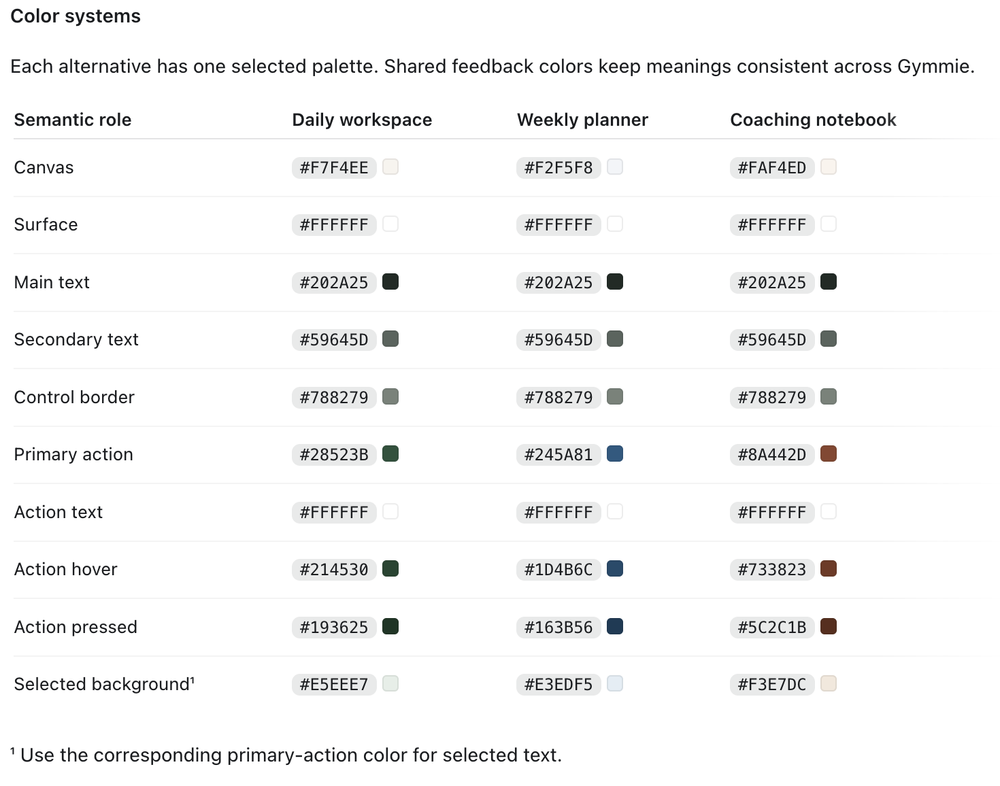
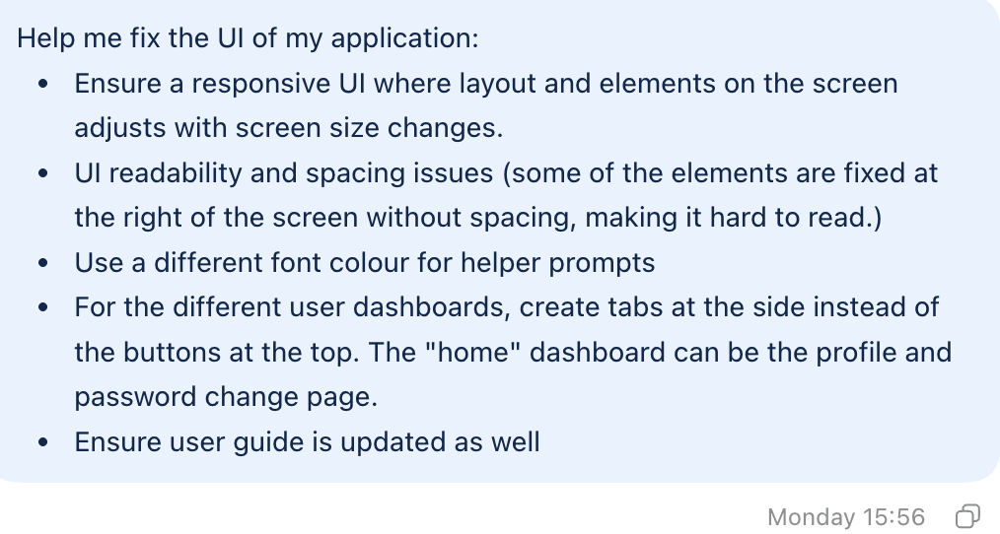
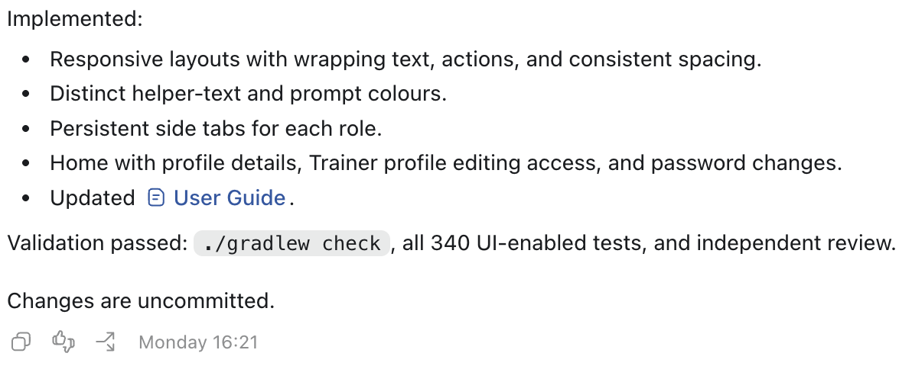

For MP2, the agent was customised with several skills targeting different stages of the software engineering process. When deciding which skills to create, I reflected on both weaknesses from MP1 and tasks in MP2 that were repetitive or required significant manual effort. This resulted in skills for UI design, test generation, exploring alternative implementations, that I created.

Each skill was defined with a specific workflow and instructions describing the expected behaviour of the agent. I then evaluated whether the skill was effective by triggering it in a new chat and examining the output. This was particularly important because I realised that the quality of a skill cannot be judged solely by how comprehensive its instructions appear. Its usefulness also depends on the quality of its output, how much intervention it requires, and the computational cost of using it.

One skill I created focused on improving the application's UI. I wanted to avoid the generic looking interfaces that AI-generated applications often produced, so my initial approach was to give the agent detailed criteria for producing a more distinctive and polished interface. The resulting skill appeared promising because it contained extensive instructions covering aspects such as layout, colours and visual consistency.

However, testing the skill showed that more detailed instructions did not necessarily produce better results. The initial version was overly restrictive and required the agent to consider too many details for each UI task. For example, it spent considerable effort reasoning about specific styling and colour choices (down to the hex code) even when they were not important to the feature being implemented. This consumed more usage credits while producing output that was not always useful.

**A snippet of the output shown:**

I therefore made the skill more generic and also simplified the workflow: understand intent and choose a direction → plan structure and styling → build and refine → polish and verify. Together with a shared stylesheet created as part of the foundation of our application, this initially worked reasonably well because only a small portion of the interface had been implemented.

However, a weakness became apparent as more features were added. Although the stylesheet maintained consistency, it also constrained the agent to the predefined styles. Components that needed additional visual meaning, such as active or inactive status tags or helper prompts, were not automatically differentiated appropriately. I had to explicitly identify these problems and create additional issues to correct them. Interestingly, I encountered fewer of these problems in MP1, where I gave the agent more freedom in UI design (I only prompted that I wanted the UI to have an overall blue theme).

If I repeated the task, I would provide the agent with a library of reference interfaces or design styles that can easily be found on the internet instead of relying mainly on textual design rules. References would communicate visual concepts such as hierarchy, spacing, component relationships and appropriate use of colour more concretely than a long list of instructions. They would also give the agent examples to adapt while still allowing flexibility, rather than forcing every component to follow a rigid set of predefined rules. I would also provide rough wireframes for important screens before implementation. This would establish the intended information hierarchy and layout while still allowing the agent to make smaller styling decisions independently.

A weakness I identified from MP1 was insufficient automated testing, so I created another skill specifically for generating tests. Its workflow was: inspect the project → match existing conventions → test observable behaviour → verify role-based access control → handle JavaFX and dependencies.

This was one of the most successful uses of the agent. It generated tests covering happy paths, invalid inputs and edge cases while following the existing testing conventions of the project. For features involving different user roles, it could also verify whether functionality was correctly restricted according to role.

This significantly improved my productivity because generating a comprehensive set of tests manually would have required substantially more time. Unlike UI design, test generation also had clearer and more objective success criteria such as whether the tests could be compiled and executed, and failures provided immediate feedback about either the implementation or the generated test. This made the skill easier to verify and reduced the amount of subjective judgement required from me.

From this, it further confirmed that AI agents were particularly effective for tasks that were structured, repetitive and objectively verifiable. Test generation had established conventions and executable feedback, whereas UI quality was more subjective and therefore required greater human judgement.

I also created a skill that generated three alternative approaches to implementing a feature or UI. This was inspired by the tree-of-thought prompting approach that I found useful in MP1, where comparing several possibilities helped me avoid immediately committing to the first solution suggested by the AI.

However, this skill was not triggered during MP2. One reason may have been that I gave the agent greater autonomy during planning. More importantly, since the team had agreed on a relatively definite set of functionality for each role, there was often less ambiguity for the agent to explore. As compared to MP1 where I went head first into creating the application with much less thought on the features.

There was also potential overlap with our ‘implement-issue’ skill, which was invoked whenever a feature was implemented. Consequently, asking the agent to explore three implementations before completing a well-defined issue could have introduced unnecessary reasoning rather than improving the final implementation.

This taught me that a skill should not be included simply because it worked well in a previous project. Its usefulness depends on the workflow surrounding it. If I repeated the project, I would either remove this skill or restrict its activation to genuinely ambiguous or high-impact design decisions where multiple viable implementations exist.

Another particularly effective skill, although not one I personally wrote (contributed by my team member), converted user stories from our Developer Guide into GitHub issues. The generated issue became a structured task for the implementation agent because it already contained the the parent epic, expected functionality and acceptance criteria.

This reduced two forms of repetitive work, manually creating GitHub issues and repeatedly translating user stories into detailed implementation requirements. It also helped establish a consistent definition of what constituted completion before implementation began.

However, human verification was still necessary. The agent could generate acceptance criteria that were technically plausible but did not accurately represent what the team intended or did not sufficiently cover the original user story. For example, for trainer cancellation of sessions, we wanted trainers to give a reason for cancellation. This was not stated in the developer guide and was thus not an acceptance criteria for that issue. However, this was an important implementation of the feature and thus proved that human verification is necessary. We also had to check that it had not hallucinated additional requirements. This showed me that AI was useful for transforming existing requirements into structured development artefacts, but it should not independently determine requirements that had not been agreed upon by the team.

One unexpected problem was the interaction between multiple skills. Towards the end of development, a single task could trigger three or four skills. Each skill appeared useful individually, but collectively they introduced significant overhead because the agent had to read, reason about and comply with several sets of instructions before completing a relatively simple task. In some cases, a task could consume around 10% of my available usage credits.

**Simple UI fix task began at 15:56:**

**Task finished at 16:21, ~20min after task was given:**

This changed how I viewed agent customisation. Initially, I assumed that adding more specialised skills would continuously improve the agent because it would have more guidance for different situations. In practice, more skills did not necessarily produce a better agent. Skills could overlap, introduce conflicting priorities, or cause the agent to perform unnecessary work. For example, triggering the ‘update-user-guide’ skill and ‘session-log’ skill both resulted in a log of the chat, resulting in 2 or more logs being created for the same chat.

I therefore became more selective towards the end of the project. When fixing minor issues, I explicitly instructed the agent not to invoke particularly expensive skills when they were unnecessary. I also stopped running the entire test suite of more than 300 tests for every small change when a smaller set of relevant tests could provide sufficient confidence. This reduced unnecessary computation while still allowing the change to be verified.

I also realised the importance of establishing appropriate guardrails for the agent. During development, I had several Codex resets available and was therefore less concerned about exhausting my usage credits. As a result, I did not establish explicit guardrails, such as limiting the amount of usage that could be consumed for a single task. In hindsight, this approach may not have been sustainable for a larger project. As mentioned, as the number of skills increased, a single request could trigger several skills and consume a disproportionate amount of credits relative to the complexity of the task. Without usage limits, this behaviour could easily scale into significant unnecessary resource consumption.

At the same time, I had configured Codex to request permission before performing certain actions. This unintentionally acted as a form of guardrail by giving me opportunities to review and stop unnecessary actions before they were executed. Despite this, some relatively simple tasks still consumed substantial credits due to the number of skills being invoked. Had I instead granted the agent unrestricted permissions while retaining the same automatically triggered skills, it could have continued performing unnecessary or duplicated actions before I had the opportunity to intervene. In future, I would therefore establish more deliberate guardrails, such as defining when expensive skills should be activated, setting limits on resource-intensive operations, running only relevant tests for minor changes, and identifying which actions require human approval. This would allow the agent to retain useful autonomy while ensuring that its computational cost remains proportional to the complexity and importance of the task.

The most important lesson I learnt about designing an effective single AI agent for software engineering is that effectiveness does not come from giving the agent as many capabilities or instructions as possible. Instead, it comes from giving it a small set of clearly scoped skills, appropriate context, objective feedback where possible, and explicit boundaries on when each capability should be used.

The test generation and GitHub issue skills were effective because their tasks were structured, repetitive and relatively easy to verify. In contrast, UI design required greater human direction because visual quality is subjective and difficult to fully specify through textual rules. The unused alternative-implementation skill further demonstrated that a capability provides little value when the surrounding workflow has already resolved the problem it was designed to address.

If I redesigned the agent, I would therefore focus less on increasing the number and detail of skills and more on skill selection and activation. I would keep specialised skills for high value tasks such as test generation, provide richer visual references and wireframes for subjective tasks such as UI design, remove or conditionally trigger overlapping skills, and introduce explicit limits on expensive actions such as full-suite testing. Ultimately, I learnt that designing an effective software engineering agent is itself a software design problem. Its capabilities need to be modular and purposeful, but they must also be coordinated carefully. Human oversight remains important not only for correcting the agent's output, but also for deciding when the 
