# Gymmie User Guide

Gymmie is a desktop application for running a gym. **Managers** maintain
membership plans and accounts, **Trainers** run training sessions, and **Members**
buy memberships and book sessions.

> **How to use this guide:** Read [Getting started](#1-getting-started),
> [Navigating Gymmie](#2-navigating-gymmie), and [Verifying the application](#3-verifying-the-application)
> first, then jump to the guide for your role. Input rules, cancellation reasons,
> and storage guidelines are collected in the [Reference](#8-reference) section.

## Table of contents

1. [Getting started](#1-getting-started)
   - [1.1 System requirements](#11-system-requirements)
   - [1.2 Launch Gymmie](#12-launch-gymmie)
   - [1.3 Sign in](#13-sign-in)
   - [1.4 Roles at a glance](#14-roles-at-a-glance)
   - [1.5 Log out](#15-log-out)
2. [Navigating Gymmie](#2-navigating-gymmie)
   - [2.1 The sidebar](#21-the-sidebar)
   - [2.2 Keyboard shortcuts](#22-keyboard-shortcuts)
   - [2.3 Window size and display](#23-window-size-and-display)
3. [Verifying the application](#3-verifying-the-application)
   - [3.1 Automated verification suite](#31-automated-verification-suite)
   - [3.2 Manual verification walkthrough](#32-manual-verification-walkthrough)
4. [Your account (all roles)](#4-your-account-all-roles)
   - [4.1 Change your display name (Managers and Members)](#41-change-your-display-name-managers-and-members)
   - [4.2 Change your password](#42-change-your-password)
5. [Manager guide](#5-manager-guide)
   - [5.1 Manager features at a glance](#51-manager-features-at-a-glance)
   - [5.2 Manage membership plans](#52-manage-membership-plans)
   - [5.3 Create, edit, archive and delete plans](#53-create-edit-archive-and-delete-plans)
   - [5.4 Provision a new account](#54-provision-a-new-account)
   - [5.5 Edit an account's display name](#55-edit-an-accounts-display-name)
   - [5.6 Deactivate or reactivate an account](#56-deactivate-or-reactivate-an-account)
6. [Trainer guide](#6-trainer-guide)
   - [6.1 Trainer features at a glance](#61-trainer-features-at-a-glance)
   - [6.2 Create a training session](#62-create-a-training-session)
   - [6.3 View your upcoming sessions](#63-view-your-upcoming-sessions)
   - [6.4 View a session roster](#64-view-a-session-roster)
   - [6.5 Edit a session](#65-edit-a-session)
   - [6.6 Cancel a session](#66-cancel-a-session)
   - [6.7 Delete an unused session](#67-delete-an-unused-session)
   - [6.8 Edit your profile](#68-edit-your-profile)
7. [Member guide](#7-member-guide)
   - [7.1 Member features at a glance](#71-member-features-at-a-glance)
   - [7.2 Buy a membership](#72-buy-a-membership)
   - [7.3 View your membership](#73-view-your-membership)
   - [7.4 Renew your membership](#74-renew-your-membership)
   - [7.5 Cancel your membership](#75-cancel-your-membership)
   - [7.6 Browse and book sessions](#76-browse-and-book-sessions)
   - [7.7 View and cancel your bookings](#77-view-and-cancel-your-bookings)
8. [Reference](#8-reference)
   - [8.1 Input limits](#81-input-limits)
   - [8.2 Booking cancellation reasons](#82-booking-cancellation-reasons)
   - [8.3 Deleting versus archiving](#83-deleting-versus-archiving)
   - [8.4 Saving the data](#84-saving-the-data)
   - [8.5 Editing the data file safely](#85-editing-the-data-file-safely)
   - [8.6 Resetting the workspace safely](#86-resetting-the-workspace-safely)
9. [Known limitations](#9-known-limitations)
10. [Troubleshooting](#10-troubleshooting)

---

## 1. Getting started

### 1.1 System requirements

Gymmie requires **JDK 25**. You do not need to install JavaFX separately. The
release JAR bundles JavaFX for Windows x64, Apple Silicon macOS, and x64 Linux.

### 1.2 Launch Gymmie

**Recommended: download the release JAR.** Get `gymmie-release.jar` from
[GitHub Releases](https://github.com/CS3227-2610-MP2-Gymmie/CS3227-2610-MP2/releases)
and run it with Java 25:

```bash
java -jar gymmie-release.jar
```

**From source:**

Open a terminal in the project root folder and run:

```bash
./gradlew run
```

On Windows, run `.\gradlew.bat run` in PowerShell.
Gymmie creates `data/gymmie.db` in the folder it was launched from. Always launch
it from the same folder so it continues using the same data.

### 1.3 Sign in

1. Enter your **Username** and **Password** on the login screen.
2. Choose **Log in** (or press **Enter** in the password field).
3. Gymmie opens the dashboard for your role.

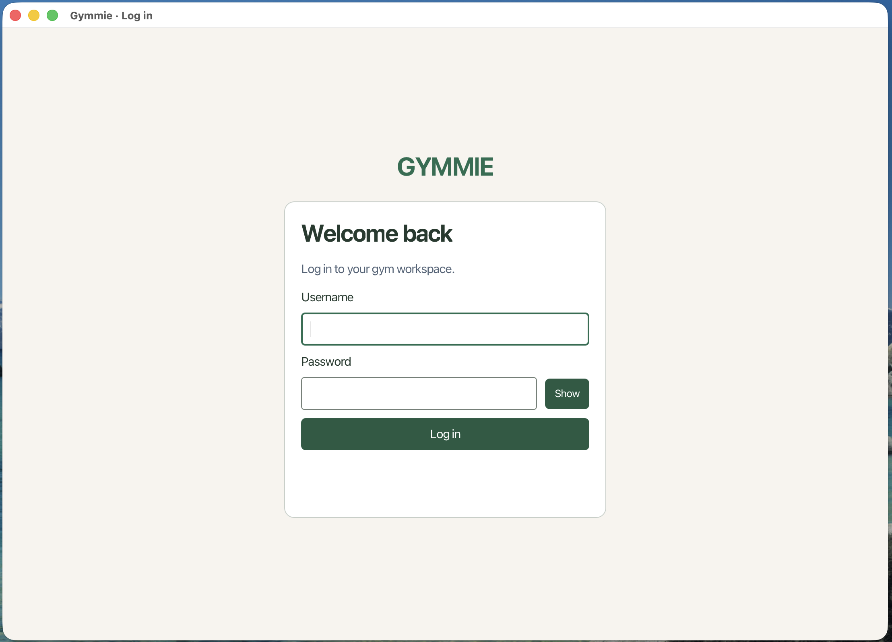

The initial Manager account is created automatically when Gymmie launches for
the first time:
- **Username:** `manager`
- **Password:** `manager123`

Only a Manager can provision new Trainer and Member accounts
(see [Provision a new account](#54-provision-a-new-account)).

**Login messages and error conditions:**
- If either field is left empty when submitting: **"Enter your username and password."**
- If the username does not exist, or the password does not match: **"Invalid username or password"**
- If valid credentials belong to an account that has been deactivated: **"This account is deactivated"**

If your account has been deactivated, you cannot sign in. Contact a Manager to reactivate your account.

### 1.4 Roles at a glance

| Role | Primary responsibilities | Key capabilities |
|------|--------------------------|------------------|
| **Manager** | Facility & membership administration | Create, edit, archive, and delete membership plans; provision and manage Trainer and Member accounts; deactivate and reactivate accounts. |
| **Trainer** | Training session instruction | Schedule, edit, cancel, and delete training sessions; view booked member rosters; customize public profile (synopsis and specializations). |
| **Member** | Workout and gym participation | Buy, view, renew, and cancel memberships; browse upcoming trainer sessions; book and cancel session reservations. |

Gymmie enforces strict Role-Based Access Control (RBAC). Roles do not inherit each
other's permissions (for example, a Manager cannot book training sessions or create
trainer schedules).

### 1.5 Log out

Choose **Log out** in the sidebar. Gymmie clears the active session and returns to
the login screen.

---

## 2. Navigating Gymmie

### 2.1 The sidebar

The sidebar on the left lets you move between screens. The current page tab is
highlighted, and the sidebar remains visible on every page.

| Role | Sidebar tabs |
|------|--------------|
| **Manager** | Home, Manage membership plans, Manage accounts |
| **Trainer** | Home, My upcoming sessions, Create session |
| **Member** | Home, My membership, Browse sessions, My bookings |

**Home** returns you to your profile summary and password form. Switching pages
discards any unsaved form inputs.

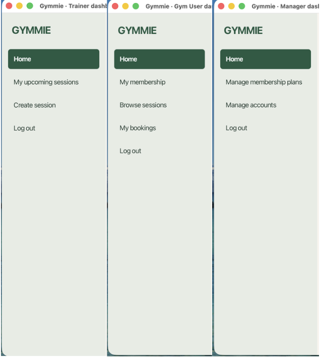

### 2.2 Keyboard shortcuts

Every user interaction in Gymmie is accessible via keyboard:

| To do this | Press |
|------------|-------|
| Move to next / previous control | **Tab** / **Shift+Tab** |
| Activate focused button or tab | **Space** or **Enter** |
| Submit form from a text field | **Enter** |
| Open date picker calendar | **F4** |
| Navigate dates in calendar | **Arrow keys**, then **Enter** to select |
| Reveal password temporarily | Hold **Space** while focused on **Show** |
| Close dialog without action | **Escape** |

### 2.3 Window size and display

Resize the window to adjust the layout width. Content cards and button groups
wrap responsively, long pages scroll vertically, and the sidebar scrolls
independently if screen height is constrained.

Helper text, prompt placeholders, and input constraints appear in a muted
blue-grey to distinguish them from field labels and entered values.

---

## 3. Verifying the application

### 3.1 Automated verification suite

Before using or evaluating Gymmie, you can run the complete automated test and
compliance suite from the project directory:

```bash
# Run Checkstyle code style and all unit/repository tests
./gradlew check

# Run full JavaFX UI navigation and integration tests (requires graphical display)
./gradlew test -PuiTests=true
```

Both commands should complete with `BUILD SUCCESSFUL`.

### 3.2 Manual verification walkthrough

To verify the main flow, launch Gymmie with `./gradlew run` or
`java -jar gymmie-release.jar` after downloading the release JAR. Use the same
launch folder each time so Gymmie uses the same `data/gymmie.db`.

1. **Manager:** Sign in as `manager` / `manager123`. Create a plan named
   `Monthly Pass` for 30 days at `50.00`. Provision a Trainer account with
   username `trainer_sam`, password `trainer123`, and display name `Sam Trainer`;
   then provision a Member account with username `member_ann`, password
   `member123`, and display name `Ann Member`. Log out.
2. **Trainer:** Sign in as `trainer_sam` / `trainer123`. Create a session for
   tomorrow at `10:00`, with a duration of 60 minutes, capacity of 10, and the
   description `Morning Strength`. Confirm it appears under **My upcoming sessions**,
   then log out.
3. **Member:** Sign in as `member_ann` / `member123`. Buy **Monthly Pass**, open
   **Browse sessions**, and book the **Morning Strength** session. Open **My
   bookings** and confirm it appears under **Upcoming bookings**.

---

## 4. Your account (all roles)

The **Home** page displays your display name, username, and role, plus personal
account management forms.

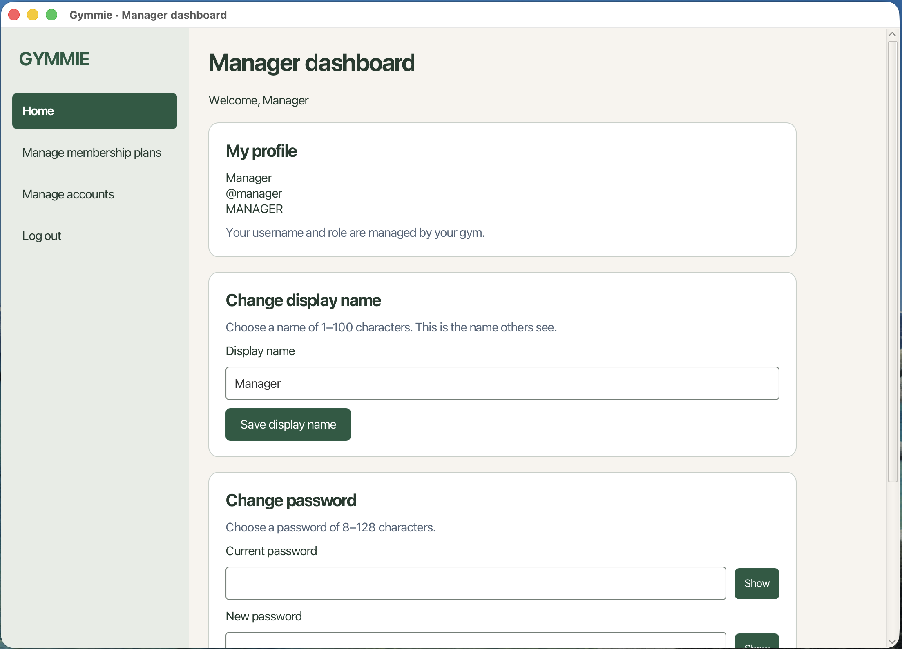

### 4.1 Change your display name (Managers and Members)

1. On **Home**, enter a new name in **Display name** under **Change display name**.
   It starts with your currently saved display name.
2. Choose **Save display name**, or press **Enter** in the field.
3. **Success: Display name changed.** confirms the save. Your welcome banner and
   profile summary update immediately.

Display names use 1–100 characters and do not need to be unique. Your username,
role, and password remain unchanged.

Trainers change their display name through their trainer profile instead
(see [Edit your profile](#68-edit-your-profile)).

### 4.2 Change your password

1. On **Home**, enter your **Current password**.
2. Enter a **New password** of 8–128 characters, and re-type it in **Confirm new password**.
3. Choose **Save password**, or press **Enter** in the confirmation field.
4. **Success: Password changed.** confirms the update. Use the new password on
   your next login.

Hold **Show** beside any password field to reveal the entered text temporarily.
Password fields are cleared on submit. Failed updates leave your stored password
unchanged.

---

## 5. Manager guide

### 5.1 Manager features at a glance

The table below lists all Manager capabilities in recommended workflow order:

| Action | Section | Description |
|--------|---------|-------------|
| **Create plan** | [Create a plan](#53-create-edit-archive-and-delete-plans) | Add a new membership plan to the catalogue. |
| **Edit plan** | [Edit a plan](#53-create-edit-archive-and-delete-plans) | Update name, duration, or price of an unarchived plan. |
| **Archive plan** | [Archive or restore a plan](#53-create-edit-archive-and-delete-plans) | Disable new purchases while preserving member purchase history. |
| **Restore plan** | [Archive or restore a plan](#53-create-edit-archive-and-delete-plans) | Re-enable purchases for a previously archived plan. |
| **Delete plan** | [Delete a plan](#53-create-edit-archive-and-delete-plans) | Permanently delete an unpurchased plan (automatically archives if purchased). |
| **Provision account** | [Provision a new account](#54-provision-a-new-account) | Create a new Trainer or Member account. |
| **Edit display name** | [Edit an account's display name](#55-edit-an-accounts-display-name) | Change the display name of any existing account. |
| **Deactivate account** | [Deactivate an account](#56-deactivate-or-reactivate-an-account) | Disable sign-in; Member deactivation also cancels future bookings. |
| **Reactivate account** | [Reactivate an account](#56-deactivate-or-reactivate-an-account) | Restore sign-in access for an inactive account. |

### 5.2 Manage membership plans

Choose **Manage membership plans** in the sidebar. Each card in the list shows the
plan name, duration in days, price formatted in SGD, and an **ACTIVE** or
**ARCHIVED** badge. Archived plans are styled with a tinted card background and a
red status badge.

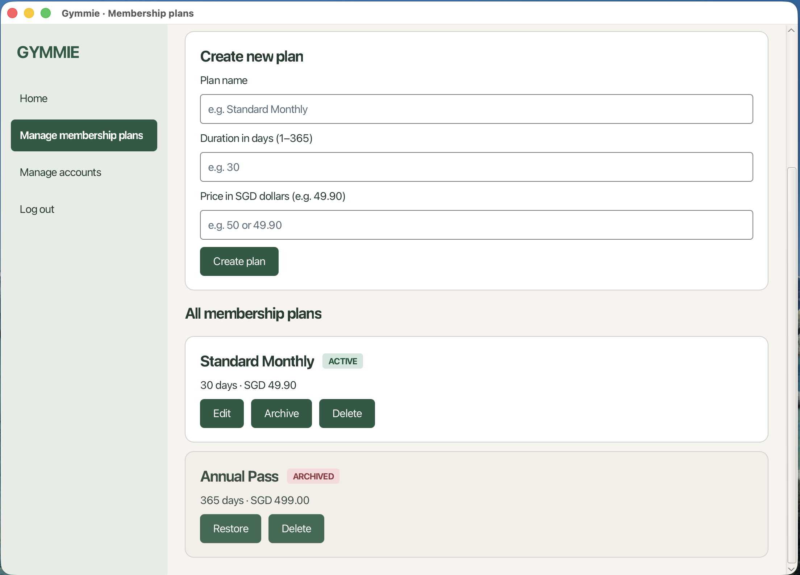

Choose **Refresh** to reload the list from storage.

### 5.3 Create, edit, archive and delete plans

**Create a plan**

1. In the **Create new plan** card, enter:
   - **Plan name**: non-blank and unique across all plans, ignoring case (for example, `Standard Monthly`). There is no length limit.
   - **Duration in days**: an integer between 1 and 365.
   - **Price**: SGD 0.00–10,000.00 with at most two decimal places (for example, `50` or `49.90`).
2. Choose **Create plan**, or press **Enter** in any field.
3. **Plan created.** confirms the creation, and the plan appears in the list.

**Edit a plan**

1. Choose **Edit** on an active plan. The form updates to **Edit plan: \<name\>**
   with its current values loaded.
2. Update the name, duration, or price, then choose **Save changes**. Choose
   **Cancel edit** to discard changes.

Archived plans cannot be edited. Editing a plan does not modify existing member
purchases, because each membership retains a historical snapshot of the price
and duration paid at purchase time.

**Archive or restore a plan**

- Choose **Archive** on an active plan to disable new purchases while preserving
  every existing member's coverage and history. The badge changes to **ARCHIVED**.
- Choose **Restore** on an archived plan to re-enable purchases.

Members holding an active membership on an archived plan can still renew it.

**Delete a plan**

Choose **Delete** on a plan card.
- If nobody has ever purchased the plan, it is permanently deleted from the database.
- If the plan has any purchase history, Gymmie preserves historical integrity and
  **archives the plan instead**, reporting: *"Plan '\<name\>' had purchase history and was archived instead."*

### 5.4 Provision a new account

Choose **Manage accounts** in the sidebar. Each card shows the account's display
name, username prefixed with `@`, role badge (**TRAINER**, **MEMBER**, or
**MANAGER**), and an **ACTIVE** or **DEACTIVATED** badge.

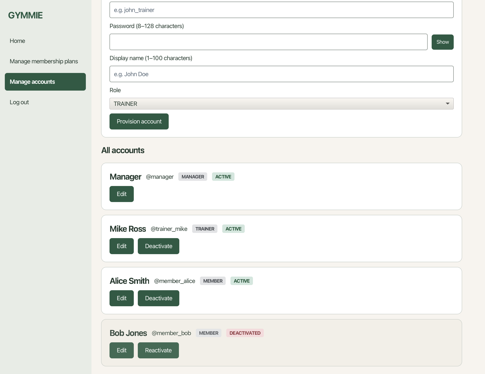

Choose **Refresh** to reload the list.

1. In the **Provision new account** card, enter:
   - **Username**: 3–30 ASCII letters, digits, underscores, or hyphens (`[A-Za-z0-9_-]`).
     Must be unique across all roles (matched case-insensitively, preserved as typed).
   - **Password**: 8–128 characters.
   - **Display name**: 1–100 characters (for example, `John Doe`).
   - **Role**: select **TRAINER** or **MEMBER**.
2. Choose **Provision account**, or press **Enter** in any field.
3. **Account provisioned.** confirms the account was created.

Provide the new user with their initial username and password. Users can update
their password at any time on their **Home** page.
Hold **Show** beside the password field to reveal the password while the button is held.

### 5.5 Edit an account's display name

1. Choose **Edit** on an account card. The form updates to **Edit account: \<username\>**
   with the username and role locked.
2. Update the display name and choose **Save changes** (or **Cancel edit** to discard).

Usernames and roles are immutable after account creation to protect data integrity.

### 5.6 Deactivate or reactivate an account

**Deactivate an account**

Choose **Deactivate** on an account card.
- The account can no longer sign in.
- If the account is a **Member**, all their future training session bookings are
  automatically cancelled in the same operation with the reason **Account deactivated**.
- If the account is a **Trainer**, their sign-in is disabled; scheduled sessions
  and past records remain in storage for historical tracking. Their sessions
  disappear from Members' **Browse sessions** list. Existing future bookings appear
  under **Cancelled bookings** with the reason **Trainer account deactivated**.
  Past bookings and explicit cancellations stay unchanged.
- The seeded Manager account (`manager`) cannot be deactivated.

**Reactivate an account**

Choose **Reactivate** on a deactivated account card. The account status returns
to **ACTIVE**, allowing the user to sign in again. Bookings cancelled during the
earlier Member deactivation are **not** re-created. For a Trainer, existing future
bookings that have not otherwise been cancelled return to **Upcoming bookings**
when Members open **My bookings** or choose **Refresh bookings**. Sessions that have already
started remain in the past.

---

## 6. Trainer guide

### 6.1 Trainer features at a glance

The table below lists all Trainer capabilities in recommended workflow order:

| Action | Section | Description |
|--------|---------|-------------|
| **Create session** | [Create a training session](#62-create-a-training-session) | Schedule a new upcoming training session. |
| **View sessions** | [View your upcoming sessions](#63-view-your-upcoming-sessions) | Review your scheduled upcoming sessions in chronological order. |
| **View roster** | [View a session roster](#64-view-a-session-roster) | Inspect booked member names and headcounts for a session. |
| **Edit session** | [Edit a session](#65-edit-a-session) | Reschedule or change capacity and description of an upcoming session. |
| **Cancel session** | [Cancel a session](#66-cancel-a-session) | Cancel a session with a written reason, cancelling all member bookings. |
| **Delete session** | [Delete an unused session](#67-delete-an-unused-session) | Permanently remove a session that has never had any bookings. |
| **Edit profile** | [Edit your profile](#68-edit-your-profile) | Update public display name, biography synopsis, and specialization tags. |

### 6.2 Create a training session

Choose **Create session** in the sidebar.

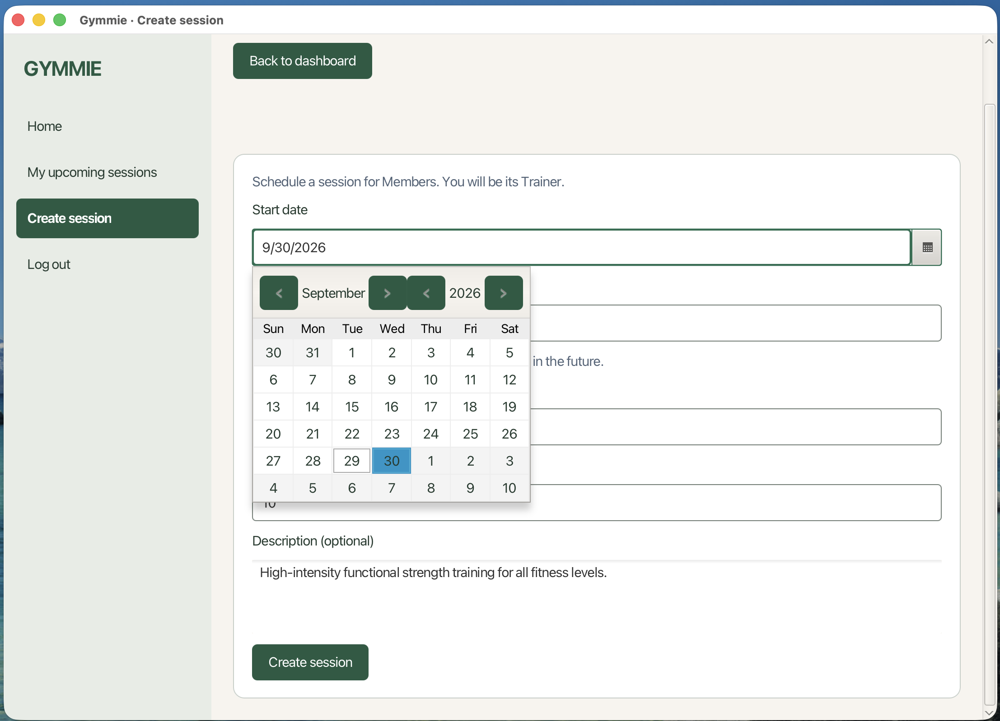

1. Open **Start date** with the calendar button and choose a future date.
2. Enter **Start time** as `HH:mm` in 24-hour local time (for example, `14:30`).
   The combined date and time must be strictly in the future.
3. Enter **Duration (minutes)**, a whole number from 15 to 240.
4. Enter **Capacity (Members)**, an integer from 1 to 50.
5. Optionally add a **Description**.
6. Choose **Create session**. **Success: Session created for …** confirms creation.

Sessions cannot overlap another uncancelled session scheduled under your account.
Back-to-back sessions (where one starts exactly when another ends) are permitted.
The gym is open 24 hours, so sessions may start at any time, including overnight.

### 6.3 View your upcoming sessions

Choose **My upcoming sessions** in the sidebar. Sessions appear in chronological
start-time order. Each card shows start date, time, duration, capacity, and description.

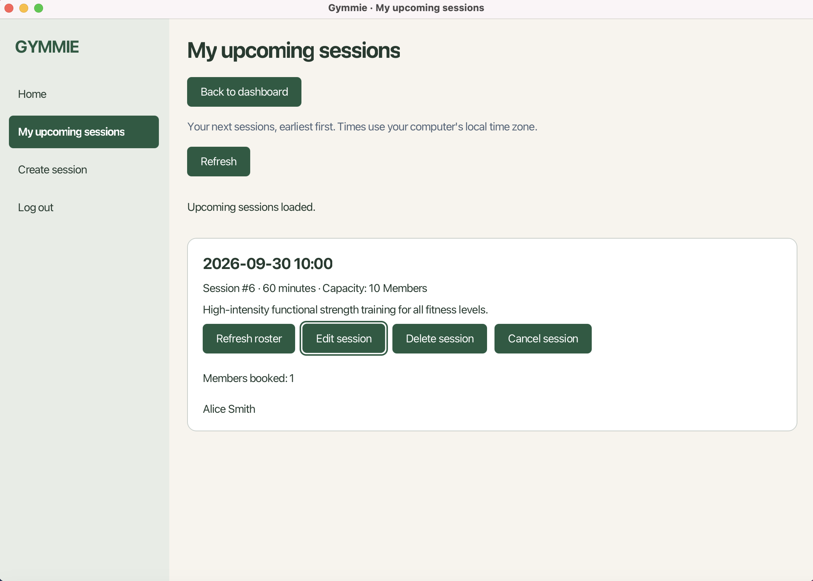

Only uncancelled sessions scheduled in the future appear here. Choose **Refresh**
to reload current sessions and headcounts.

### 6.4 View a session roster

1. On **My upcoming sessions**, choose **View roster** on a session card.
2. The roster expands inside the card, listing booked Members in alphabetical
   order by display name, along with total headcount.

Cancelled bookings are excluded. Usernames and contact details are omitted for privacy.

### 6.5 Edit a session

1. On **My upcoming sessions**, choose **Edit session** on a card.
2. Adjust start date, start time (`HH:mm`), duration, capacity, or description.
3. Choose **Save changes**. **Success: Session changes saved.** confirms the update.
4. Choose **Back to upcoming sessions** to return.

The new capacity cannot be less than the current number of active bookings. The
new time cannot overlap your other uncancelled sessions. Cancelled sessions cannot
be edited.

### 6.6 Cancel a session

1. On **My upcoming sessions**, choose **Cancel session** on the card.
2. Review the session details and current bookings in the confirmation dialog.
3. Enter a mandatory **Reason for cancellation** (cannot be blank).
4. Choose **Confirm cancellation**.

The session is marked cancelled, and all active member reservations are
cancelled together with the reason **Trainer cancelled session**, accompanied by
your written explanation. Cancelled sessions leave your upcoming list.

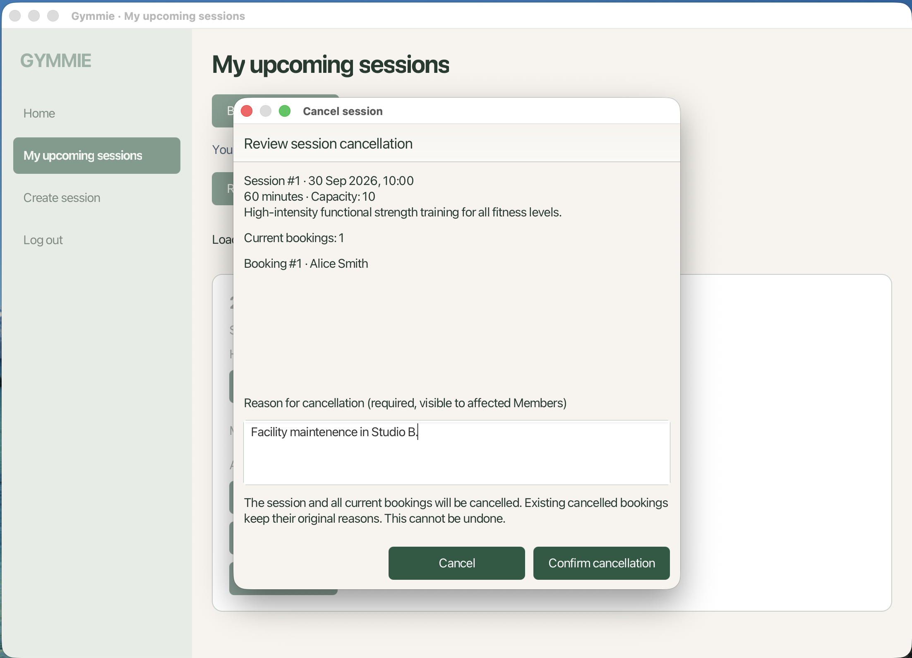

### 6.7 Delete an unused session

1. On **My upcoming sessions**, choose **Delete session** on an eligible card.
2. Confirm the prompt by choosing **OK**.

A session can be deleted **only if it has never had any bookings**. If even a
single member has ever booked the session (even if subsequently cancelled), Gymmie
rejects deletion to protect audit history. Use [Cancel a session](#66-cancel-a-session) instead.

### 6.8 Edit your profile

Choose **Home**, then choose **Edit my profile**.

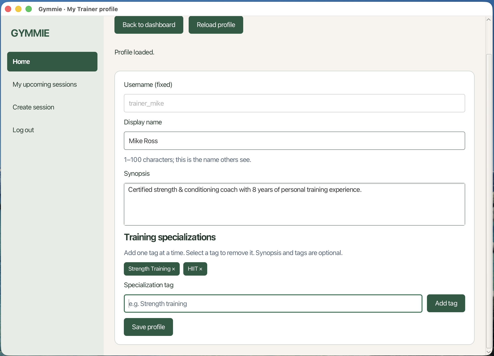

1. Edit **Display name** (1–100 characters).
2. Edit **Synopsis** (biographical description; multiple lines supported).
3. Add or remove **Specialization tags** (e.g., `Strength training`, `HIIT`).
4. Choose **Save profile**.

Prospective Members see your synopsis and specializations when browsing sessions.

---

## 7. Member guide

### 7.1 Member features at a glance

The table below lists all Member capabilities in recommended workflow order:

| Action | Section | Description |
|--------|---------|-------------|
| **Buy membership** | [Buy a membership](#72-buy-a-membership) | Purchase an available membership plan to gain access to classes. |
| **View membership** | [View your membership](#73-view-your-membership) | Review current active plan, status, and expiry date. |
| **Renew membership** | [Renew your membership](#74-renew-your-membership) | Extend current plan duration without changing plan type. |
| **Cancel membership** | [Cancel your membership](#75-cancel-your-membership) | Terminate active membership early (cancels upcoming bookings). |
| **Browse sessions** | [Browse and book sessions](#76-browse-and-book-sessions) | Filter and explore available classes taught by active Trainers. |
| **Book session** | [Browse and book sessions](#76-browse-and-book-sessions) | Reserve a place in an eligible upcoming training session. |
| **View bookings** | [View and cancel your bookings](#77-view-and-cancel-your-bookings) | Review upcoming, past, and cancelled class reservations. |
| **Cancel booking** | [View and cancel your bookings](#77-view-and-cancel-your-bookings) | Release a reservation before class start time. |

### 7.2 Buy a membership

Choose **My membership** in the sidebar.

1. Under **Buy a membership**, choose an available plan. Each option lists its
   duration in days and price in SGD. Archived plans are not offered for purchase.
2. Choose **Purchase membership**.

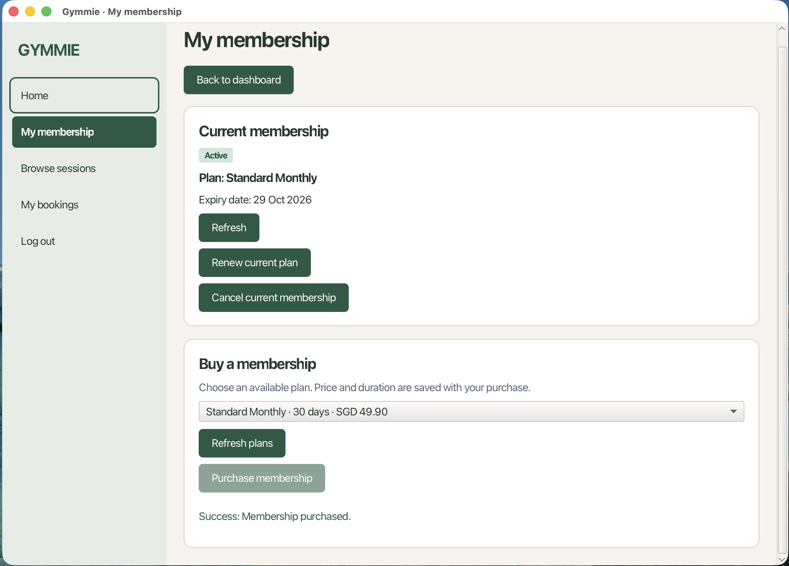

> **Payment handling note:** Choosing **Purchase membership** records the
> membership in Gymmie and makes it active immediately. Gymmie does not process
> electronic payments or credit cards; fee collection and payment handling are
> conducted in person at the gym reception desk.

A Member can hold only **one active membership** at a time; the purchase button
is disabled while a membership is active.

### 7.3 View your membership

On **My membership**, the **Current membership** card displays your plan name,
expiry date, and status:

| Status | Meaning |
|--------|---------|
| **Active** (green) | A membership covers today. Expiry date is inclusive. |
| **Expired** (red) | Your latest membership has expired. Eligible for renewal. |
| **Inactive** (red) | No current or past active membership on record. |
| **Cancelled** (red) | Your latest membership was terminated early. |

Choose **Refresh** to reload current membership coverage.

### 7.4 Renew your membership

Choose **Renew current plan** on **My membership** when your membership is active
or expired.

- Renewal keeps the **same plan**, even if that plan has since been archived.
- Renewal extends coverage by the plan's duration, starting from the later of today
  or your current expiry date.
- The membership's original purchase start date is retained on record.
- You cannot switch plan types during a renewal. To switch to a different plan,
  wait until your current membership expires (or cancel it), then purchase the new plan.

### 7.5 Cancel your membership

1. Choose **Cancel current membership** on **My membership**.
2. Review the confirmation alert and choose **OK**.

**Important cancellation effects:**
- Membership coverage ends immediately. **There are no refunds.**
- All upcoming bookings for sessions that have not started are automatically
  cancelled with the reason **Membership cancelled**.
- Past sessions and bookings that were already cancelled remain unchanged.

### 7.6 Browse and book sessions

Choose **Browse sessions** in the sidebar to view upcoming classes offered by active Trainers.

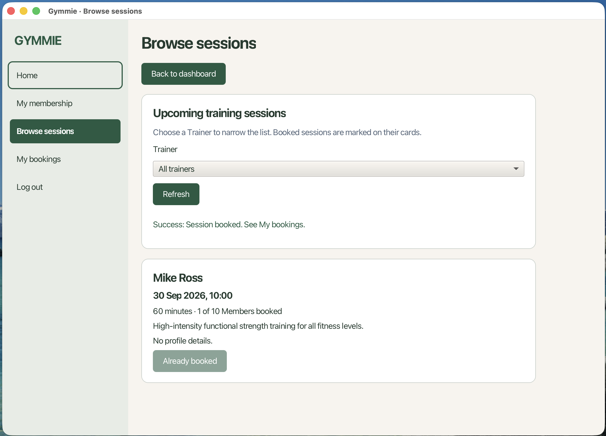

Each card displays the Trainer's display name, synopsis, specializations, session
date and time, duration, description, capacity, and current booking count.

1. Filter classes using the **Trainer** dropdown (or select **All trainers**).
2. Choose **Refresh** to reload availability.
3. Choose **Book session** on an eligible card. The button changes to **Already booked**.

**Full** is disabled when no places remain; **Already booked** is shown instead
when you already have a booking, even if the session is full. If the Trainer has
no profile information, the card says **No profile details.** Only active
Trainers' sessions are listed. If booking reports **This session is full**, a
place was taken after the list loaded; choose **Refresh**. You can rebook a
cancelled booking when all booking rules below are still met.

**To book a session, all of the following rules must be met:**
- You hold an active membership covering today.
- The session has open capacity.
- The session start time is strictly in the future.
- The session starts on or before your membership expiry date.
- You do not already hold an active booking for this session.

### 7.7 View and cancel your bookings

Choose **My bookings** in the sidebar.

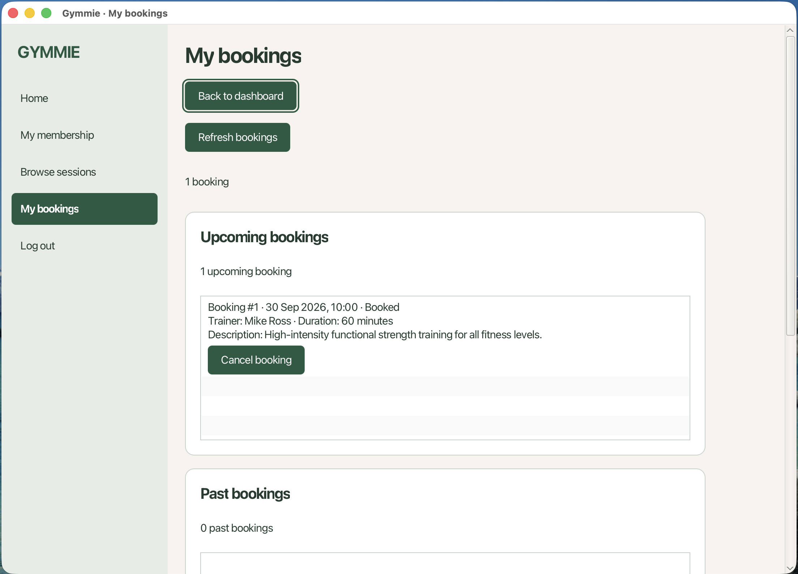

Bookings are organized into three sections:
- **Upcoming bookings:** Active reservations for future sessions, soonest first.
- **Past bookings:** Sessions that have started, with the most recent first. A
  session starting exactly now is past.
- **Cancelled bookings:** Cancelled reservations, most recent session first,
  with the cancellation reason and (when a Trainer cancelled) the Trainer's
  written reason.

If your Trainer is deactivated, future reservations appear under **Cancelled bookings**
with **Trainer account deactivated**. Reactivation restores them to **Upcoming bookings**
provided the session has not started and the booking has not otherwise been cancelled.
Open this page or choose **Refresh bookings** to see the latest account status. Past bookings
and explicit cancellations are unchanged by Trainer status changes.

**Cancel a booking:** Choose **Cancel booking** on an Upcoming card and confirm.
Your reserved place is immediately released for other members. Bookings cannot be
cancelled once a session has started.

**Cancelled bookings** has no cancel button, including reservations marked
**Trainer account deactivated**. If the Trainer is reactivated before the session
starts, the reservation returns to **Upcoming bookings**, where you can cancel it.

If you rebook a cancelled session while the booking rules are met, its booking
moves from **Cancelled** back to **Upcoming** and the earlier cancellation reason
is cleared.

---

## 8. Reference

### 8.1 Input limits

| Field | Validation rule |
|-------|-----------------|
| **Username** | 3–30 characters using ASCII letters, digits, underscores, or hyphens (`[A-Za-z0-9_-]`). Globally unique across all roles. Matched case-insensitively, stored with original casing preserved. Immutable once created. |
| **Password** | 8–128 characters. Validated upon entry; stored only as salted cryptographic hashes. |
| **Display name** | 1–100 characters. Does not require uniqueness. |
| **Plan name** | Non-blank and globally unique across plans, ignoring case. No length limit. |
| **Plan duration** | Integer between 1 and 365 days. |
| **Plan price** | SGD 0.00–10,000.00 with at most 2 decimal places (e.g., `49.90` or `50`). |
| **Session start** | Must be strictly in the future at submission time (`HH:mm`, 24-hour local time). |
| **Session duration** | Integer between 15 and 240 minutes. |
| **Session capacity** | Integer between 1 and 50 Members (must be $\ge$ current active booking count when editing). |

### 8.2 Booking cancellation reasons

| Cancellation reason | Trigger condition |
|---------------------|-------------------|
| **Trainer cancelled session** | Trainer cancelled the scheduled class. The Trainer's written explanation is displayed alongside. |
| **Member cancelled booking** | Member released their own reservation prior to session start. |
| **Membership cancelled** | Member terminated their membership early, triggering automatic cancellation of future class reservations. |
| **Trainer account deactivated** | Trainer is inactive; future reservations return automatically on reactivation before session start, unless otherwise cancelled. |
| **Account deactivated** | Manager deactivated the Member's account, automatically releasing all future reservations. |

### 8.3 Deleting versus archiving

Gymmie applies soft-deletion and archiving principles to preserve audit trails:

| Record type | Lifecycle & removal rule |
|-------------|--------------------------|
| **Membership plan** | Hard-deleted only if never purchased by any Member. If purchase history exists, automatically archived instead. Archiving is reversible via **Restore**. |
| **Training session** | Hard-deleted only if no Member has ever booked the session. If any booking history exists, it must be cancelled with a stated reason. |
| **User account** | Never hard-deleted. Soft-deactivated instead; account profile and historical activity are preserved. Deactivation is reversible via **Reactivate**. |
| **Booking** | Never hard-deleted. A cancelled booking has a cancellation reason; no cancellation timestamp is stored. |
| **Membership** | Never hard-deleted. A membership can be cancelled without a reason; no cancellation timestamp is stored. |

### 8.4 Saving the data

Gymmie stores all data locally on your computer in an embedded SQLite database:
- **Default file path:** `data/gymmie.db` (relative to the folder Gymmie was launched from).
- All changes (account creation, plan updates, bookings, and cancellations) commit
  immediately inside ACID-compliant transactions.
- State persists across sign-outs and application restarts.
- **Backing up data:** To back up your data, close Gymmie and copy `data/gymmie.db`
  to a secure backup directory.

### 8.5 Editing the data file safely

`data/gymmie.db` is a standard SQLite 3 database file.
- **Direct editing is strongly discouraged:** Manual modifications using SQLite
  browsers or command-line clients bypass service-layer validations and can corrupt
  critical invariants (such as password hash structures, foreign-key linkages, and
  price snapshot consistency).
- **Safe inspection:** If inspecting tables directly using tools like `sqlite3 data/gymmie.db`,
  ensure Gymmie is closed first to avoid database locking errors (`SQLITE_BUSY`).
  Do not modify table schemas or user version PRAGMAs.

### 8.6 Resetting the workspace safely

If you need to reset Gymmie to a clean first-run state for testing or evaluation:

1. Close Gymmie completely.
2. In your terminal, delete or rename the database file from the folder Gymmie
   was launched from. On macOS or Linux, choose one command:
   ```bash
   rm data/gymmie.db
   # or, to keep a backup:
   mv data/gymmie.db data/gymmie.db.backup
   ```
   In Windows Command Prompt, choose one command:
   ```cmd
   del data\gymmie.db
   rem or, to keep a backup:
   ren data\gymmie.db gymmie.db.backup
   ```
3. Relaunch Gymmie from the same folder. Gymmie recreates the database and the
   seeded Manager (`manager` / `manager123`) on next launch.

---

## 9. Known limitations

- **No payment processing or revenue tracking:** Gymmie records membership purchases
  and durations, but does not process credit cards or track revenue. Payment collection
  takes place offline at the gym counter.
- **No direct plan switching:** A Member holding an active membership cannot directly
  upgrade or switch plans mid-cycle. To switch plans, the member must either wait for
  their current plan to expire or cancel it first, then purchase the desired plan.
- **No attendance check-in:** Gymmie provides session rosters displaying booked
  members, but does not support marking attendance or check-in verification.
- **Renewing an expired membership keeps its original start date:** Renewing extends
  coverage from the later of today or the previous expiry date, while retaining the
  membership's original initial purchase date.
- **Rebooking overwrites cancellation reason:** If a Member cancels a booking and
  later rebooks the same session, the new active booking overwrites the previous
  cancellation record and clears the earlier cancellation reason.
- **Seeded Manager cannot be deactivated:** The built-in `manager` account is
  protected to prevent accidental administrative lock-out.
- **Usernames and roles are permanent:** Once created, account usernames and roles
  cannot be modified.
- **No self-service password recovery:** There is no automated password reset link.
  Users must change their password on their Home page while logged in.
- **No Manager password reset:** A Manager cannot reset a user's forgotten password.
- **Trainer status updates:** Deactivating a Trainer hides their sessions from
  Browse sessions and shows future Member reservations as Cancelled. Reactivation
  restores eligible future reservations. Open My bookings or refresh to see changes.
- **Release JAR platform coverage:** The release JAR supports Windows x64,
  Apple Silicon macOS, and x64 Linux. Intel Mac and ARM Linux users must run
  Gymmie from source.
- **One instance per data folder:** Run only one Gymmie instance against each
  data folder at a time.
- **No cancellation refunds:** Cancelling an active membership terminates coverage
  immediately without refund.

---

## 10. Troubleshooting

| Symptom | Cause | Solution |
|---------|-------|----------|
| **"Invalid username or password"** | Incorrect login credentials entered. | Verify spelling and casing; re-enter your password. |
| **"This account is deactivated"** | Your account was deactivated by a Manager. | Contact a gym Manager to reactivate your account. |
| **"Enter your username and password."** | One or both fields were submitted empty. | Enter both credentials before clicking Log in. |
| **Purchase membership button is disabled** | You already hold an active membership. | You can hold only one active membership at a time. |
| **Book session button is disabled or missing** | Session is full, has already started, falls after your membership expiry, or your membership is inactive. | Check your membership status, verify session timing, or choose **Refresh** to check for newly opened spots. |
| **"Cannot delete session" error** | Session has prior booking history. | Sessions with past or cancelled bookings cannot be deleted. Choose **Cancel session** instead. |
| **Deleted plan remains in list as ARCHIVED** | Plan was previously purchased by Members. | Gymmie automatically archives purchased plans to protect member records. |
| **Application appears out of date** | Changes occurred in another session. | Choose **Refresh** on the current screen to reload the latest database state. |
