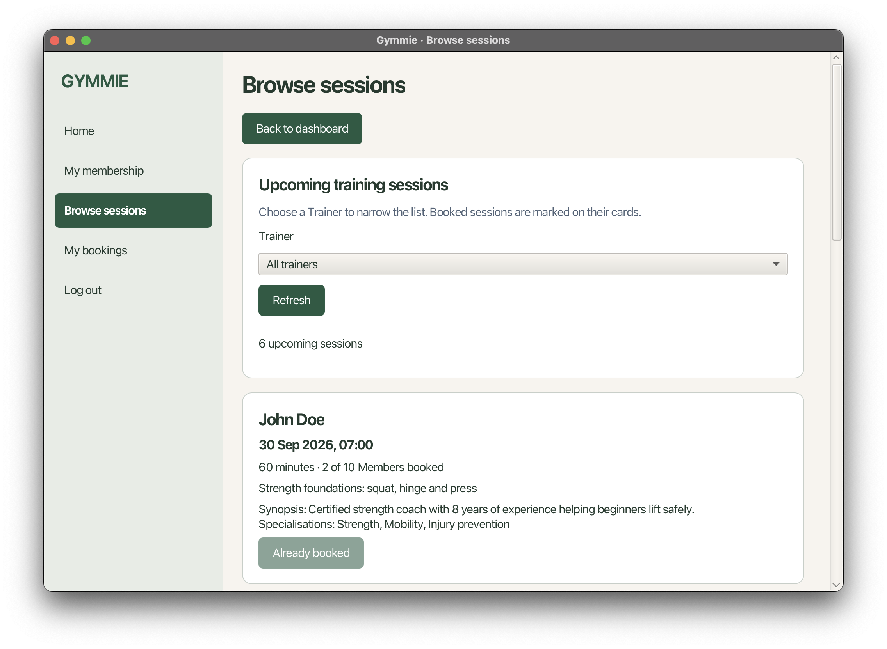

# Gymmie

A Java desktop application for running a gym. Managers maintain membership plans
and accounts, Trainers run training sessions, and Members buy memberships and book
sessions.



## Documentation

| Guide                                | Read it if you want to...                                 |
| ------------------------------------ | --------------------------------------------------------- |
| [User Guide](UserGuide.md)           | Use Gymmie as a Manager, Trainer or Member.               |
| [Developer Guide](https://github.com/CS3227-2610-MP2-Gymmie/CS3227-2610-MP2/blob/master/docs/DeveloperGuide.md) | Understand the design, set up the project, or contribute. |

## What you can do

| Role        | Features                                                                                                                    |
| ----------- | --------------------------------------------------------------------------------------------------------------------------- |
| **Manager** | Create, edit, archive, restore and delete membership plans; create accounts, edit display names, and deactivate or reactivate accounts. |
| **Trainer** | Maintain a profile; create, edit, cancel and delete unused sessions; view upcoming sessions and rosters.                               |
| **Member**  | Buy, renew and cancel a membership; browse and book sessions; view and cancel bookings.                                                 |

## Quick start

You need **JDK 25**. Download `gymmie-release.jar` from
[GitHub Releases](https://github.com/CS3227-2610-MP2-Gymmie/CS3227-2610-MP2/releases)
and run:

```shell
java -jar gymmie-release.jar
```

To run from source, clone the repository and open a terminal in its folder:

```shell
git clone https://github.com/CS3227-2610-MP2-Gymmie/CS3227-2610-MP2.git
cd CS3227-2610-MP2
./gradlew run
```

The release JAR bundles JavaFX for Windows x64, Apple Silicon macOS, and x64
Linux. On Windows PowerShell, use `.\gradlew.bat run` to run from source.
Gymmie stores data in `data/gymmie.db` relative to the folder it was launched
from, so always launch it from the same folder. See the
[User Guide](UserGuide.md#1-getting-started) for signing in and the
[Developer Guide](https://github.com/CS3227-2610-MP2-Gymmie/CS3227-2610-MP2/blob/master/docs/DeveloperGuide.md#setting-up-getting-started)
for build details.

## Project links

- [Source code](https://github.com/CS3227-2610-MP2-Gymmie/CS3227-2610-MP2)
- [Issues](https://github.com/CS3227-2610-MP2-Gymmie/CS3227-2610-MP2/issues)
- [Pull requests](https://github.com/CS3227-2610-MP2-Gymmie/CS3227-2610-MP2/pulls)

## Team

| GitHub                                              | Role focus |
| --------------------------------------------------- | ---------- |
| [naa-siuuuu-ff](https://github.com/naa-siuuuu-ff)   | Manager    |
| [shawnnygoh](https://github.com/shawnnygoh)         | Member     |
| [TaiaYovelaPang](https://github.com/TaiaYovelaPang) | Trainer    |

Built for CS3227 Software Engineering, Mini Project 2.
